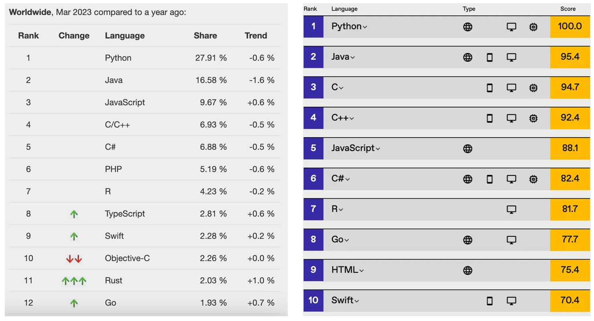
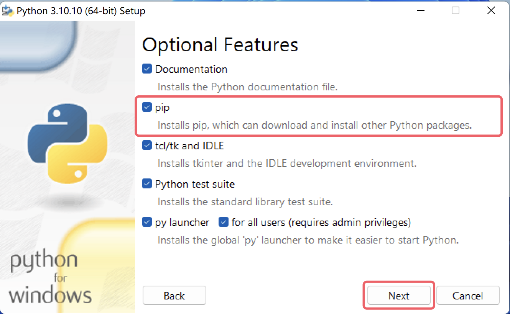
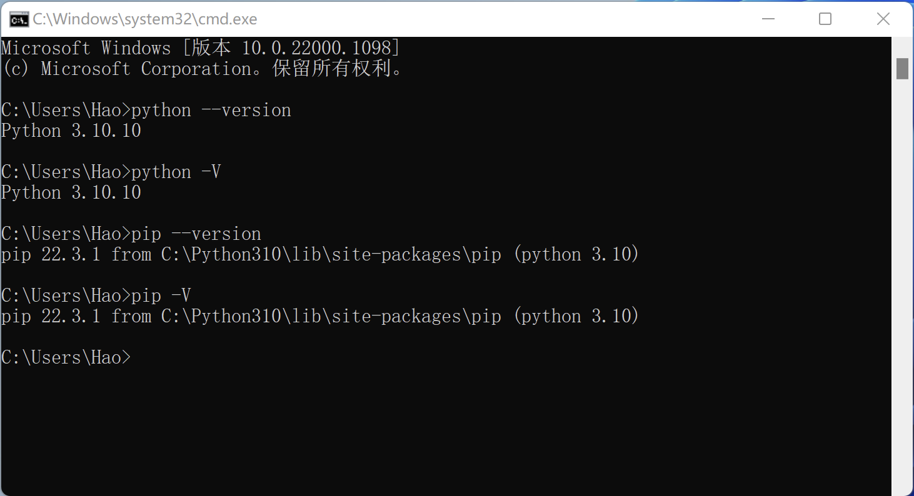

[→ Следующий урок](02.Первая программа на Python.md)

---

# День 1 — Первое знакомство с Python

## Введение в Python

Python (британское произношение: /ˈpaɪθən/; американское произношение: /ˈpaɪθɑːn/) — это язык программирования, изобретенный голландцем Гвидо ван Россумом (Guido van Rossum). На сегодняшний день это самый популярный язык программирования в мире с наибольшим количеством пользователей. Python делает акцент на читаемости кода и простоте синтаксиса. По сравнению с такими влиятельными языками программирования, как C, C++ и Java, Python позволяет пользователям выразить свои намерения с меньшим количеством кода. Ниже представлены рейтинги языка Python от нескольких авторитетных источников. Первое изображение предоставлено TIOBE Index, третье — IEEE Spectrum. Второе изображение заслуживает особого внимания, оно показывает популярность языков программирования на крупнейшей в мире платформе для хостинга кода GitHub, где последние четыре года Python занимает первое место.




### История Python

#### Происхождение Python

1989 год: Рождественские каникулы, Амстердам. Гвидо ван Россум, чтобы скоротать время, решил разработать новый скриптовый язык — интерпретатор для языка ABC. Причины следующие:

- Увлечение языком ABC, но неудовлетворенность его недостатками
- Личный интерес к программированию и желание создать собственный язык

Название «Python» происходит не от змеи, а от британского комедийного сериала «Летающий цирк Монти Пайтона» (Monty Python's Flying Circus), который Гвидо любил смотреть.

#### Важные вехи

- 1991: Первый интерпретатор Python родился, написан на языке C (до сих пор называется CPython), способный вызывать библиотеки языка C
- 1994: Python 1.0 официально выпущен
- 2000: Python 2.0 с важными функциями (сборщик мусора, поддержка Unicode)
- 2008: Python 3.0 выпущен (несовместим с Python 2.x)
- 2020: Python 2.x официально прекратил поддержку

#### Философия Python

Используя команду `import this` в интерактивном режиме, можно увидеть Дзен Python (The Zen of Python), написанный Тимом Петерсом (Tim Peters), который отражает философию языка:

```python
>>> import this
The Zen of Python, by Tim Peters

Beautiful is better than ugly.
Explicit is better than implicit.
Simple is better than complex.
Complex is better than complicated.
Flat is better than nested.
Sparse is better than dense.
Readability counts.
Special cases aren't special enough to break the rules.
Although practicality beats purity.
Errors should never pass silently.
Unless explicitly silenced.
In the face of ambiguity, refuse the temptation to guess.
There should be one-- and preferably only one --obvious way to do it.
Although that way may not be obvious at first unless you're Dutch.
Now is better than never.
Although never is often better than *right* now.
If the implementation is hard to explain, it's a bad idea.
If the implementation is easy to explain, it may be a good idea.
Namespaces are one honking great idea -- let's do more of those!
```

### Преимущества Python

1. **Простота**: Легко учить и использовать
2. **Читаемость**: Код похож на английский язык
3. **Богатые библиотеки**: Обширная стандартная библиотека и множество сторонних пакетов
4. **Кроссплатформенность**: Работает на Windows, macOS, Linux
5. **Открытый исходный код**: Бесплатно использовать и модифицировать
6. **Высокоуровневый**: Автоматическое управление памятью
7. **Интерпретируемый**: Не требуется компиляция
8. **Многоцелевой**: Подходит для веб-разработки, анализа данных, искусственного интеллекта, автоматизации и т.д.

### Недостатки Python

1. **Скорость выполнения**: Медленнее компилируемых языков (C, C++)
2. **Потребление памяти**: Больше потребляет памяти
3. **Мобильная разработка**: Не лучший выбор для мобильных приложений
4. **Глобальная блокировка интерпретатора (GIL)**: Ограничивает многопоточность

## Установка Python

### Windows

1. Перейдите на [python.org](https://www.python.org/downloads/)
2. Загрузите последнюю версию Python
3. Запустите установщик
4. **Важно**: Отметьте "Add Python to PATH"
5. Нажмите "Install Now"


### macOS

**Вариант 1: Homebrew**
```bash
brew install python3
```

**Вариант 2: Официальный установщик**
1. Скачайте с [python.org](https://www.python.org/downloads/)
2. Откройте файл `.pkg`
3. Следуйте инструкциям установщика



### Linux

**Ubuntu/Debian:**
```bash
sudo apt update
sudo apt install python3 python3-pip
```

**Fedora:**
```bash
sudo dnf install python3 python3-pip
```

**Arch Linux:**
```bash
sudo pacman -S python python-pip
```


### Проверка установки

Откройте терминал/командную строку:

```bash
python --version
# или
python3 --version
```

Вы должны увидеть версию Python (например, `Python 3.11.0`).

## Запуск Python

### Интерактивный режим

Введите в терминале:

```bash
python
# или
python3
```

Вы увидите приглашение `>>>`. Попробуйте:

```python
>>> print("Hello, World!")
Hello, World!
>>> 2 + 2
4
>>> exit()
```




### Запуск Python-скриптов

Создайте файл `hello.py`:

```python
print("Hello, World!")
print("Привет, Python!")
```

Запустите его:

```bash
python hello.py
```

Вывод:

```
Hello, World!
Привет, Python!
```


### Комментарии

```python
# Это однострочный комментарий

"""
Это многострочный
комментарий (docstring)
"""

'''
Тоже многострочный
комментарий
'''
```

## Резюме

В первый день мы:

1. Познакомились с историей и философией Python
2. Узнали о преимуществах и недостатках языка
3. Установили Python на различных платформах
4. Настроили среду разработки
5. Написали первую программу

Продолжайте изучение! В следующем уроке мы погрузимся в синтаксис и типы данных Python.

---

[→ Следующий урок](02.Первая/ программа/ на/ Python.md)

