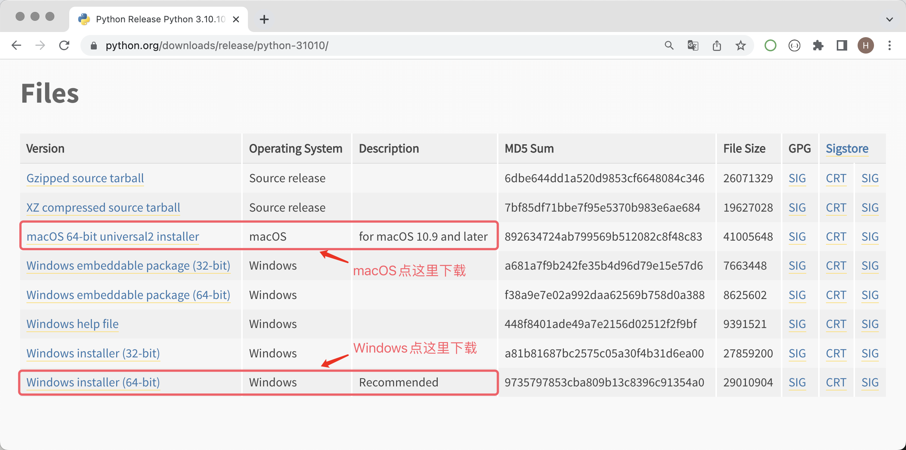
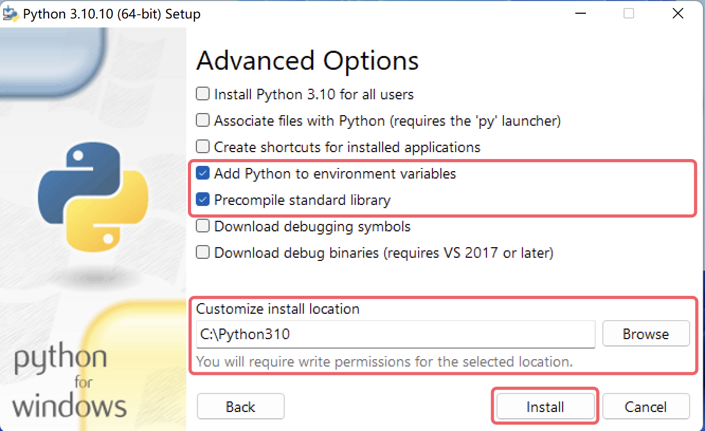
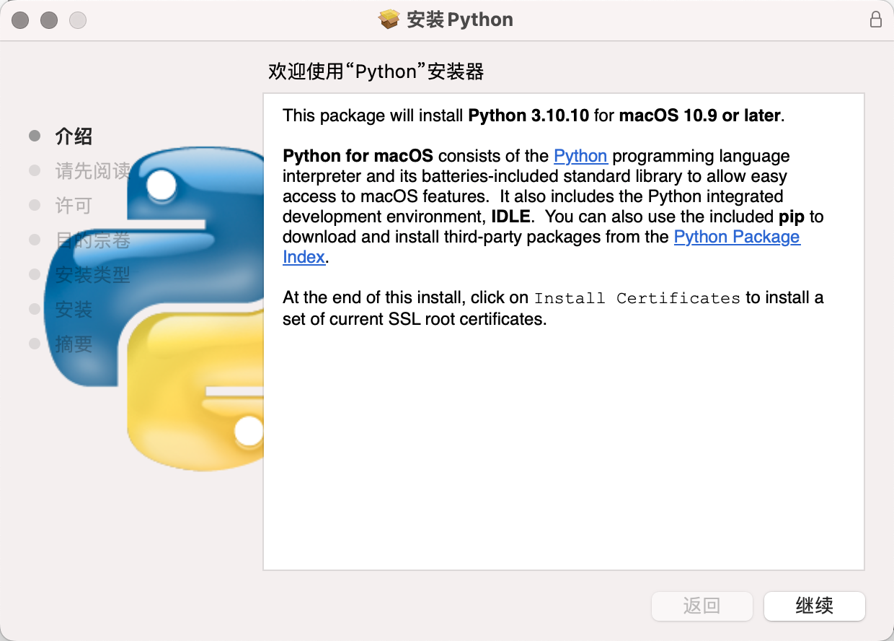

[Следующий урок →](02.Первая_программа_на_Python.md)
---

## Знакомство с Python

### Введение в Python

Python (британское произношение: /ˈpaɪθən/; американское произношение: /ˈpaɪθɑːn/) — это язык программирования, изобретенный голландцем Гвидо ван Россумом (Guido von Rossum), в настоящее время это самый популярный язык программирования в мире с наибольшим количеством пользователей. Python делает акцент на читаемости кода и простоте синтаксиса. По сравнению с такими влиятельными языками программирования, как C, C++, Java, Python позволяет пользователям выражать свои намерения с меньшим количеством кода. Ниже приведены рейтинги языка Python из нескольких авторитетных рейтингов языков программирования, где первое изображение предоставлено TIOBE Index, а третье изображение — IEEE Spectrum. Стоит отметить второе изображение, которое показывает популярность языков программирования на крупнейшей в мире платформе размещения кода GitHub — последние четыре года язык Python занимает первое место.

#### Хронология Python

Ниже приведены некоторые важные вехи в развитии языка Python:

1. Декабрь 1989: Гвидо ван Россум решил разработать новый скриптовый язык и его интерпретатор, чтобы скоротать скучное Рождество. Новый язык станет преемником языка ABC, в основном для замены Unix shell и языка C в системном администрировании. Поскольку Гвидо был преданным фанатом телесериала BBC «*Monty Python's Flying Circus*», он выбрал слово Python в качестве названия нового языка.
2. Февраль 1991: Гвидо ван Россум опубликовал первоначальный код интерпретатора Python в группе новостей alt.sources, обозначенный как версия 0.9.0.
3. Январь 1994: Выпущен Python 1.0, место, где начались мечты.
4. Октябрь 2000: Выпущен Python 2.0, весь процесс разработки Python стал более прозрачным, начала медленно формироваться экосистема.
5. Декабрь 2008: Выпущен Python 3.0, введены многие новые возможности современных языков программирования, но без полной обратной совместимости.
6. Апрель 2011: Первый выпуск pip, у языка Python появился свой инструмент управления пакетами.
7. Июль 2018: Гвидо ван Россум объявил о "постоянном отпуске" с должности "Benevolent Dictator For Life" (человек, имеющий окончательное право решения при возникновении споров в сообществе открытых проектов).
8. Январь 2020: После 11 лет сосуществования Python 2 и Python 3, официальная поддержка обновлений и обслуживания Python 2 была прекращена, пользователям рекомендуется как можно скорее перейти на Python 3.
9. В настоящее время: Python широко применяется в больших языковых моделях (GPT-3, GPT-4, BERT и др.), компьютерном зрении (распознавание изображений, обнаружение объектов, генерация изображений и др.), интеллектуальных рекомендациях (YouTube, Netflix, ByteDance и др.), автономном вождении (Waymo, Apollo и др.), распознавании речи, науке о данных, количественной торговле, автоматизированном тестировании, автоматизации операций и других областях. Экосистема языка Python также весьма процветающая.

> **Примечание**: Номер версии большинства программного обеспечения обычно состоит из трех частей вида A.B.C, где A представляет основной номер версии, который увеличивается только при полной переписке или появлении изменений, несовместимых с предыдущими версиями; B представляет обновление функций, увеличивается при появлении новых функций; C представляет небольшие изменения (например, исправление ошибки), увеличивается при любом изменении.

#### Достоинства и недостатки Python

У языка Python много достоинств, вот несколько из них:

1. **Простой и элегантный**, по сравнению со многими другими языками программирования, Python **легче освоить**.
2. Можно сделать больше с меньшим количеством кода, **повышая эффективность разработки**.
3. Открытый исходный код, **мощное сообщество и экосистема**.
4. **Может делать очень много вещей**, обладает высокой адаптивностью.
5. **Клеевой язык**, может связывать вещи, разработанные на других языках.
6. Интерпретируемый язык, легче **кроссплатформенный**, может работать на различных операционных системах.

Главный недостаток Python — **низкая эффективность выполнения** (общая проблема интерпретируемых языков). Если для вас важнее эффективность выполнения кода, C, C++ или Go могут быть лучшим выбором.

### Установка окружения Python

Чтобы начать свое путешествие в программировании на Python, сначала нужно установить окружение Python на компьютер, проще говоря, установить интерпретатор Python, необходимый для выполнения программ Python. Мы рекомендуем установить официальный интерпретатор Python 3, написанный на языке C, который обычно также называется CPython — это, вероятно, ваш лучший выбор на данный момент. Сначала нам нужно найти ссылку для загрузки на [странице загрузки](https://www.python.org/downloads/) официального сайта. После нажатия кнопки "Download" и перехода на страницу загрузки необходимо выбрать подходящий установщик Python 3 в соответствии с вашей операционной системой, как показано ниже.

После входа на страницу загрузки некоторые версии Python не предоставляют установщики для систем Windows и macOS, а предоставляют только архивы с исходным кодом. Для тех, кто знаком с системой Linux, мы можем установить из исходного кода; для пользователей Windows или macOS мы **настоятельно рекомендуем** использовать установщики. Например, если вы хотите установить Python 3.10, выбор Python 3.10.10 или Python 3.10.11 позволит найти установочные пакеты для Windows или macOS, тогда как другие версии могут иметь только исходный код, как показано ниже.

#### Окружение Windows

Далее мы рассмотрим на примере Windows 11, как установить окружение Python в операционной системе Windows. Дважды щелкните установщик, загруженный с официального сайта, откроется мастер установки, как показано ниже.

Во-первых, обязательно отметьте опцию "Add python.exe to PATH", она поможет нам добавить интерпретатор Python в переменную среды PATH системы Windows (если не понимаете — не страшно, просто отметьте); во-вторых, "Use admin privileges when installing py.exe" — для получения прав администратора в процессе установки, рекомендуется отметить. Затем выберите "Customize Installation" для использования режима пользовательской установки — это выбор профессионалов, а вы (притворяетесь) тем самым профессионалом. Не рекомендуется использовать "Install Now" (установка по умолчанию).

Далее мастер установки предложит отметить необходимые "Optional Features" (опциональные возможности), здесь можно выбрать все. Стоит упомянуть второй пункт — это инструмент управления пакетами Python pip, который поможет нам устанавливать сторонние библиотеки и инструменты, поэтому обязательно отметьте его, затем нажмите "Next" для перехода к следующему этапу.

Далее следует выбор "Advanced Options" (расширенных опций), здесь мы рекомендуем отметить только "Add Python to environment variables" и "Precompile standard library", первая поможет нам автоматически настроить переменные среды, вторая предварительно скомпилирует стандартную библиотеку (создаст файлы `.pyc`), так что при использовании не потребуется временная компиляция. Снова скажу: если не понимаете — не страшно, просто отметьте. "Customize install location" (пользовательский путь установки) ниже **настоятельно рекомендуется** изменить на пользовательский путь, в этом пути не должно быть китайских иероглифов, пробелов или других специальных символов, обратите на это внимание — это избавит вас от многих ненужных проблем в будущем. После настройки нажмите "Install" для начала установки.

При успешной установке появится изображение, показанное ниже. Ключевое слово успешной установки — "successful", если установка не удалась, здесь будет слово "failed".

После завершения установки можно открыть "Командную строку" или PowerShell в Windows, затем ввести `python --version` или `python -V` для проверки успешности установки. Эта команда проверяет номер версии интерпретатора Python. Если увидите изображение, показанное ниже, поздравляем, окружение Python установлено успешно. Здесь мы рекомендуем также проверить, доступен ли инструмент управления пакетами pip Python, соответствующая команда — `pip --version` или `pip -V`.

> **Примечание**: Если в процессе установки возникает ошибка или сообщение о неудаче, скорее всего, в вашей системе Windows отсутствуют некоторые файлы динамических библиотек или необходимые инструменты сборки. Можно скачать "Visual Studio 2022 Build Tools" с [официального сайта Microsoft](https://visualstudio.microsoft.com/zh-hans/downloads/) для исправления, как показано ниже. Если неудобно скачивать с официального сайта Microsoft, можно использовать следующую ссылку на Baidu Cloud Disk для получения инструмента восстановления, ссылка: https://pan.baidu.com/s/1iNDnU5UVdDX5sKFqsiDg5Q код: cjs3.
>
> 
>
> Загруженный "Visual Studio 2022 Build Tools" выше требует подключения к интернету для работы. После запуска появится изображение, показанное ниже, можно отметить соответствующие опции для исправления, как показано на рисунке. Процесс исправления требует загрузки соответствующих пакетов через интернет, этот процесс может занять много времени. После успешного исправления может потребоваться перезагрузка операционной системы.
>
> 

#### Окружение macOS

Установка окружения Python на macOS проще, чем в системе Windows. Загруженный с официального сайта установочный пакет — это файл `pkg`, после двойного щелчка достаточно постоянно нажимать "Продолжить", и установка будет завершена, практически не требуется никаких настроек и выборов, как показано ниже.

После завершения установки можно ввести команду `python3 --version` в инструменте "Терминал" macOS для проверки успешности установки, обратите внимание, что команда здесь `python3`, а не `python`!!! Затем проверим инструмент управления пакетами, введите команду `pip3 --version`, как показано ниже.

#### Другие способы установки

Некоторые могут рекомендовать новичкам напрямую установить [Anaconda](https://www.anaconda.com/download/success), потому что Anaconda поможет установить интерпретатор Python и некоторые часто используемые сторонние библиотеки, кроме того, предоставляет некоторые удобные инструменты, особенно подходит для новичков. Я лично не рекомендую этот способ, потому что при установке Anaconda вы непонятно зачем установите кучу полезных и бесполезных сторонних библиотек (занимающих много места на диске), затем ваш терминал или командная строка будут изменены Anaconda (каждый раз при запуске автоматически активируется виртуальное окружение), это не соответствует **принципу наименьшего удивления** в дизайне программного обеспечения. Другие мелкие проблемы с Anaconda здесь не буду подробно описывать. Если вы все же хотите использовать Anaconda, рекомендуется установить Miniconda, он находится на той же странице загрузки, что и Anaconda.

Также новички часто слышат или говорят: "Мне нужно писать программы на Python, разве не достаточно установить PyCharm?". Здесь коротко поясню: PyCharm — это всего лишь инструмент, помогающий писать код на Python, он сам по себе не способен выполнять код Python. Выполнение кода Python зависит от интерпретатора Python, который мы установили выше. Конечно, некоторые версии PyCharm при создании проекта Python, если не обнаружат окружение Python на вашем компьютере, предложат загрузить интерпретатор Python через интернет. Установку и использование PyCharm мы рассмотрим на следующем уроке.

### Заключение

Подведем итог тому, что мы узнали:

1. Язык Python очень мощный, может делать много вещей, поэтому стоит его изучить.
2. Для использования языка Python сначала нужно установить окружение Python, то есть интерпретатор Python, необходимый для выполнения программ Python.
3. В системе Windows можно ввести `python --version` в командной строке или PowerShell для проверки успешности установки окружения Python; в системе macOS можно ввести `python3 --version` в терминале для проверки.

---
[Следующий урок →](02.Первая_программа_на_Python.md)

