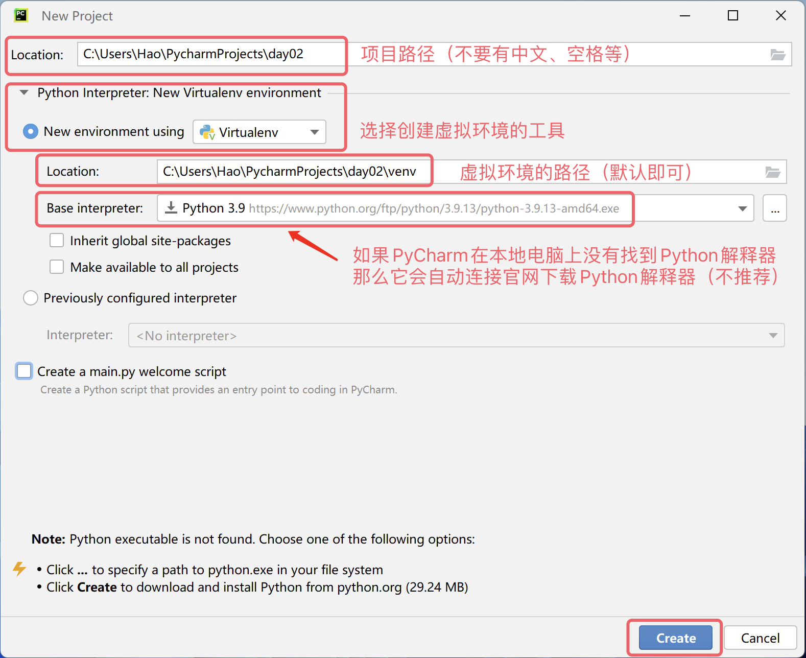

## Первая программа на Python

В предыдущем уроке мы узнали о прошлом и настоящем языка Python и подготовили интерпретатор, необходимый для запуска программ на Python. Уверен, вы уже не терпите начать своё путешествие в программирование на Python, но возникает новая задача: где писать программы на Python и как их запускать?

### Инструменты для написания кода

Ниже мы расскажем о нескольких инструментах, с помощью которых можно писать и запускать код на Python. Вы можете выбрать то, что подходит именно вам. Конечно, для новичков я лично рекомендую PyCharm, поскольку он не требует много настроек, очень мощный и дружелюбен к начинающим. Если вы уже слышали о PyCharm или он вам нравится, можете пропустить описание других инструментов и сразу перейти к разделу о PyCharm.

#### Стандартная интерактивная среда

Откройте в Windows "Командную строку" или "PowerShell" и введите

`python`

затем нажмите 

`Enter`

— эта команда перенесёт нас в интерактивную среду. Интерактивная среда означает, что мы вводим одну строку кода и нажимаем 

`Enter`

— код тут же выполняется, и если есть результат, он отображается в окне, как показано ниже.

```
Bash
Python 3.10.10
Type "help", "copyright", "credits" or "license" for more information.
>>> 2 * 3
6
>>> 2 + 3
5
>>>
```

> **Примечание**: пользователям macOS нужно открыть "Terminal" и ввести
> 
> `python3`
> 
> чтобы войти в интерактивную среду.

Если хотите выйти из интерактивной среды, введите в ней

`quit()`

как показано ниже.

```
Bash
>>> quit()
```

#### Более удобная интерактивная среда - IPython

IPython — это улучшенная интерактивная среда для Python, которая предоставляет более богатые возможности, такие как подсветка синтаксиса, автодополнение и многое другое. Чтобы установить IPython, можно использовать следующую команду:

```
python -m pip install ipython
```

После установки вы можете запустить IPython, введя `ipython` в командной строке.


#### Более продвинутая интерактивная среда - Jupyter

Jupyter Notebook — это веб-приложение, которое позволяет создавать и делиться документами, содержащими код, уравнения, визуализации и текст. Для установки Jupyter можно использовать следующую команду:

```
python -m pip install jupyter
```

После установки можно запустить Jupyter Notebook командой:

```
jupyter notebook
```


#### Текстовые редакторы

Вы также можете использовать текстовые редакторы, такие как Notepad++, Sublime Text, Atom, Visual Studio Code и другие, для написания кода на Python. Эти инструменты обычно предоставляют подсветку синтаксиса и другие полезные функции для программирования.


#### PyCharm — интегрированная среда разработки

PyCharm — это профессиональная интегрированная среда разработки (IDE) для Python, разработанная JetBrains. Она предоставляет множество функций, таких как отладчик, система контроля версий, умное автодополнение и многое другое.





Теперь наша первая программа на Python запущена и работает, круто! Кстати, у PyCharm есть всплывающее окно "Совет дня", которое научит вас некоторым хитростям работы с PyCharm, как показано на рисунке ниже. Если оно не нужно, просто закройте его; если не хотите, чтобы оно появлялось снова, поставьте галочку "Don't show tips on startup" перед закрытием.


### Привет, мир

По традиции в индустрии, первая программа, которую мы пишем при изучении любого языка программирования, выводит

`hello, world`

поскольку этот код был написан великим Деннисом Ритчи (отцом языка C, который вместе с Кеном Томпсоном разработал операционную систему Unix) и Брайаном Керниганом (изобретателем языка awk) в их бессмертной книге "*The C Programming Language*". Ниже приведена версия на языке Python.

```python
print('hello, world')
```

> **Внимание**: скобки и кавычки в приведённом выше коде введены в английской раскладке. Если случайно написать китайские скобки или кавычки, при выполнении кода появится ошибка типа 
> 
> `SyntaxError: invalid character '（' (U+FF08)`
> 
> или 
> 
> `SyntaxError: invalid character ''' (U+2018)`

Приведённый выше код содержит только одну инструкцию. В этой инструкции мы использовали функцию `print`, которая может помочь нам вывести указанное содержимое; `'hello, world'` в скобках функции `print` — это строка, представляющая текстовое содержимое; в языке Python мы можем использовать одинарные или двойные кавычки для обозначения строки. В отличие от языков программирования C, C++ или Java, инструкции в коде Python не нужно заканчивать точкой с запятой, то есть если мы хотим написать ещё одну инструкцию, нужно просто перейти на новую строку, как показано в коде ниже. Кроме того, коду Python не нужна входная функция `main` для выполнения, что обязательно при написании исполняемого кода на C, C++ или Java — это знакомо многим программистам, но в языке Python это не обязательно.

```python
print('hello, world')
print('goodbye, world')
```

Если мы не используем интегрированную среду разработки, такую как PyCharm, мы также можем напрямую вызвать интерпретатор Python для выполнения программы на Python. Мы можем сохранить приведённый выше код в файл с именем 

`example01.py`

Для системы Windows предположим, что файл находится в каталоге 

`C:\code`

Откроем "Командную строку" или "PowerShell" и введём следующую команду, чтобы запустить его.

```powershell
python C:\code\example01.py
```

Для системы macOS предположим, что наш файл находится в каталоге 

`/Users/Hao`

Тогда в терминале можно ввести следующую команду для запуска программы.

```Bash
python3 /Users/Hao/example01.py
```

> **Подсказка**: если путь довольно длинный и не хочется вводить его вручную, можно перетащить файл прямо в "Командную строку" или "Терминал", и полный путь к файлу будет введён автоматически.

Попробуйте изменить приведённый выше код, например, замените `hello, world` в одинарных кавычках на другое содержимое или напишите несколько таких инструкций, чтобы посмотреть, какой результат получится. Нужно напомнить, что при написании кода на Python лучше писать только одну инструкцию в строке. Хотя можно использовать `;` в качестве разделителя для написания нескольких инструкций в одной строке, это сделает код очень некрасивым и лишит его хорошей читаемости.

### Комментарии в коде

Комментарии — важная часть языка программирования, используемая для объяснения назначения кода в коде, тем самым повышая читаемость кода. Конечно, мы также можем временно отключить части кода, которые в данный момент не нужно выполнять, добавив комментарии, чтобы при необходимости повторного использования этого кода можно было просто убрать символы комментариев. Проще говоря, **комментарии делают код более понятным, но не влияют на результат выполнения кода**.

В Python есть две формы комментариев:

1. Однострочный комментарий: начинается с `#` и пробела, может закомментировать всю строку от `#` до конца.

2. Многострочный комментарий: начинается тремя кавычками (обычно двойными), заканчивается тремя кавычками, обычно используется для добавления многострочных пояснений.

```python
"""
Первая программа на Python - hello, world
Версия: 1.0
Автор: Лао Хао
"""
# print('hello, world')
print("Привет, мир!")
```

### Заключение

Теперь мы запустили нашу первую программу на Python, разве это не приносит чувство достижения?! Если вы будете продолжать учиться, через некоторое время мы сможем делать ещё более крутые вещи с языком Python. В наше время программирование, как и английский язык, для многих людей является навыком, который обязательно нужно освоить.
