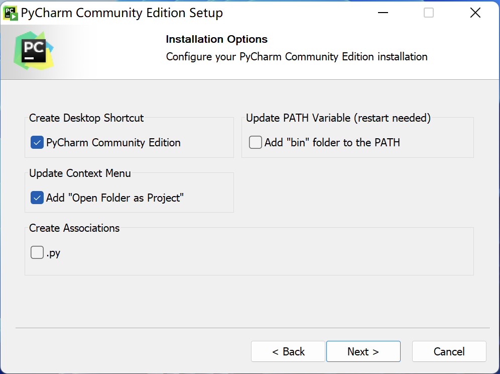
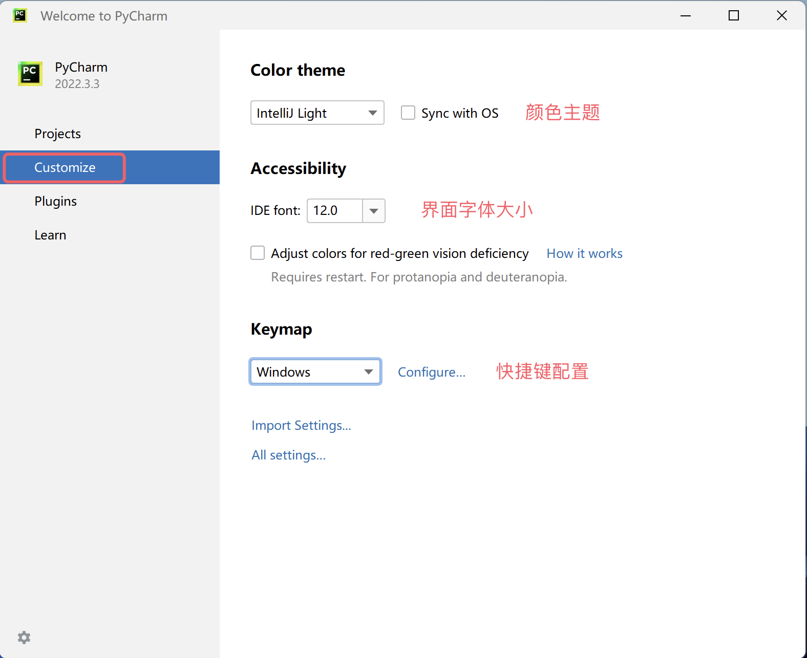

[← Предыдущий урок](01.Первое_знакомство_c_Python.md) | [Следующий урок →](03.Переменные.md)
---

## Первая программа на Python

На предыдущем уроке мы узнали о прошлом и настоящем языка Python, подготовили окружение интерпретатора, необходимое для выполнения программ Python. Полагаю, вы уже не можете дождаться начала своего путешествия в программировании на Python, но возникла новая проблема: где мы должны писать программы на Python и как их запускать?

### Инструменты для написания кода

Далее мы расскажем о нескольких инструментах для написания и запуска кода на Python, вы можете выбрать подходящий инструмент в соответствии со своими потребностями. Конечно, для начинающих я лично рекомендую использовать PyCharm, потому что он не требует много настроек, очень мощный и дружелюбен к новичкам. Если вы также слышали о PyCharm или он вам нравится, можете пропустить описание других инструментов ниже и сразу перейти к разделу о PyCharm.

#### Стандартное интерактивное окружение

Откроем инструмент "Командная строка" или "PowerShell" в Windows, введем `python` и нажмем клавишу `Enter`. Эта команда переведет нас в интерактивное окружение. Интерактивное окружение — это когда мы вводим строку кода и нажимаем клавишу `Enter`, код сразу выполняется. Если код дает результат, результат отображается в окне, как показано ниже.

```Bash
Python 3.10.10
Type "help", "copyright", "credits" or "license" for more information.
>>> 2 * 3
6
>>> 2 + 3
5
>>>
```

> **Примечание**: Пользователям системы macOS нужно открыть инструмент "Терминал", ввести `python3` для входа в интерактивное окружение.

Если хотите выйти из интерактивного окружения, можно ввести `quit()` в интерактивном окружении, как показано ниже.

```Bash
>>> quit()
```

#### Лучшее интерактивное окружение - IPython

Пользовательский опыт вышеупомянутого интерактивного окружения не очень хорош, вы почувствуете это, когда попробуете. Мы можем использовать IPython для его замены, потому что IPython предоставляет более мощные функции редактирования и взаимодействия. Мы можем использовать инструмент управления пакетами Python `pip` в командной строке или терминале для установки IPython, как показано ниже.

```bash
pip install ipython
```

> **Подсказка**: Перед использованием вышеуказанной команды для установки IPython можно сначала использовать команду `pip config set global.index-url https://pypi.doubanio.com/simple` или `pip config set global.index-url https://pypi.tuna.tsinghua.edu.cn/simple/` для изменения источника загрузки на китайское зеркало Douban или зеркало Tsinghua, иначе процесс загрузки и установки может быть очень медленным.

Далее можно использовать следующую команду для запуска IPython и входа в интерактивное окружение.

```bash
ipython
```

> **Примечание**: Есть также веб-версия IPython под названием Jupyter, мы представим её, когда она нам понадобится.

#### Божество текстового редактора - Visual Studio Code

Visual Studio Code — это редактор кода, разработанный Microsoft, способный работать на таких операционных системах, как Windows, Linux и macOS. Он поддерживает подсветку синтаксиса, автодополнение, многоточечное редактирование, отладку и другие удобные функции, а также поддерживает множество языков программирования. Если вам нужно выбрать продвинутый инструмент текстового редактора, настоятельно рекомендую Visual Studio Code. О его [загрузке](https://code.visualstudio.com/), установке и использовании заинтересованные читатели могут изучить самостоятельно.


#### Интегрированная среда разработки - PyCharm

Если вы используете язык Python для разработки коммерческих проектов, мы рекомендуем использовать более профессиональный инструмент PyCharm. PyCharm — это интегрированная среда разработки (IDE), предоставляемая чешской компанией [JetBrains](https://www.jetbrains.com/) специально для языка Python. Интегрированная среда разработки обычно означает инструмент разработки, предоставляющий серию мощных функций и удобных операций, таких как написание кода, выполнение кода, отладка кода, анализ кода, контроль версий и т.д., поэтому особенно подходит для разработки коммерческих проектов. Мы можем найти [ссылку для загрузки](<https://www.jetbrains.com/pycharm/download>) PyCharm на официальном сайте компании JetBrains, как показано на рисунке ниже.


Официально предоставляются две версии PyCharm: одна — бесплатная версия Community Edition с относительно ограниченными функциями, но для начинающих вполне достаточно; другая — платная версия Professional Edition с очень мощными функциями, но требующая ежегодной или ежемесячной оплаты, новые пользователи могут бесплатно попробовать её в течение 30 дней. Установка PyCharm не представляет никакой сложности, просто запустите загруженный установщик и используйте настройки по умолчанию для установки. Для пользователей системы Windows на одном из этапов можно отметить "Создать ярлык на рабочем столе" и "Добавить в контекстное меню "Open Folder as Project"", как показано на рисунке ниже.



При первом запуске PyCharm на экране импорта настроек PyCharm сразу выберите "Do not import settings", затем увидите приветственный экран, показанный ниже. Здесь можно сначала нажать на опцию "Customize" для персонализации настроек PyCharm.



Далее в опции "Projects" можно нажать "New Project" для создания нового проекта. Здесь также можно "открыть существующий проект" или "получить проект с сервера контроля версий (VCS)", как показано ниже.


При создании проекта нужно указать путь к проекту и создать "виртуальное окружение". Мы рекомендуем, чтобы каждый проект Python работал в своем собственном виртуальном окружении. Если в вашей системе еще нет окружения Python, PyCharm предоставит ссылку для загрузки с официального сайта. Когда вы нажмете кнопку "Create" для создания проекта, он загрузит интерпретатор Python через интернет, как показано ниже.


Конечно, мы не рекомендуем так делать, потому что на предыдущем уроке мы уже установили окружение Python. При наличии окружения Python в системе PyCharm обычно автоматически обнаруживает местоположение интерпретатора Python и создает виртуальное окружение на его основе, поэтому экран, который вы увидите, должен выглядеть как показано ниже.


> **Примечание**: Скриншоты выше взяты из системы Windows. Если используется система macOS, путь к проекту и путь к интерпретатору Python будут отличаться от приведенных выше.

После создания проекта появится экран, показанный ниже. Мы можем щелкнуть правой кнопкой мыши по папке проекта, выбрать "New" в меню, затем "Python File" для создания файла Python. При именовании файла рекомендуется использовать комбинацию английских букв и подчеркиваний. Созданный файл Python автоматически откроется в редактируемом состоянии.


Далее мы можем написать наш код Python в окне редактора. После написания кода можно щелкнуть правой кнопкой мыши в окне, выбрать пункт меню "Run" для запуска кода. Окно "Run" внизу покажет результат выполнения кода, как показано ниже.


Вот и всё, наша первая программа на Python уже работает, круто, правда?! Кстати, у PyCharm есть всплывающее окно "Совет дня", которое научит вас небольшим хитростям использования PyCharm, как показано ниже. Если не нужно, просто закройте. Если не хотите, чтобы оно появлялось снова, перед закрытием можно отметить "Don't show tips on startup".


### Привет, мир

По отраслевой традиции первая программа, которую мы пишем при изучении любого языка программирования, выводит `hello, world`, потому что этот код был написан великим Деннисом Ритчи (отцом языка C, вместе с Кеном Томпсоном разработавшим операционную систему Unix) и Брайаном Керниганом (изобретателем языка awk) в их бессмертной работе «*The C Programming Language*». Ниже приведена версия на языке Python.

```python
print('hello, world')
```

> **Внимание**: Круглые скобки и одинарные кавычки в приведенном выше коде вводятся в режиме английского ввода. Если случайно написать их китайскими символами, при запуске кода появится ошибка типа `SyntaxError: invalid character '（' (U+FF08)` или `SyntaxError: invalid character ''' (U+2018)`.

В приведенном выше коде только одно выражение. В этом выражении мы использовали функцию `print`, которая помогает нам выводить указанное содержимое. `'hello, world'` в круглых скобках функции `print` — это строка, представляющая текстовое содержимое. В языке Python мы можем использовать одинарные или двойные кавычки для представления строки. В отличие от таких языков программирования, как C, C++ или Java, выражения в коде Python не нужно завершать точкой с запятой. Если мы хотим написать еще одно выражение, достаточно просто перейти на новую строку, код показан ниже. Кроме того, код Python не требует написания функции входа с именем `main` для его выполнения. Предоставление функции входа — это необходимое условие для написания исполняемого кода на C, C++ или Java, что знакомо многим программистам, но в языке Python это не обязательно.

```python
print('hello, world')
print('goodbye, world')
```

Если не использовать интегрированную среду разработки, такую как PyCharm, мы также можем напрямую вызвать интерпретатор Python для выполнения программы Python. Мы можем сохранить приведенный выше код в файл с именем `example01.py`. Для системы Windows, предположим, что файл находится в каталоге `C:\code`, откроем "Командную строку" или "PowerShell" и введем следующую команду для его запуска.

```powershell
python C:\code\example01.py
```

Для системы macOS, предположим, что наш файл находится в каталоге `/Users/Hao`, тогда можно ввести следующую команду в терминале для запуска программы.

```Bash
python3 /Users/Hao/example01.py
```

> **Подсказка**: Если путь длинный и не хочется вводить его вручную, мы можем перетащить файл непосредственно в "Командную строку" или "Терминал", что автоматически введет полный путь к файлу.

Можете попробовать изменить приведенный выше код, например, заменить `hello, world` в одинарных кавычках на другое содержимое или написать несколько таких выражений, посмотрите, какой будет результат. Нужно напомнить, что при написании кода на Python лучше писать только одно выражение на строку. Хотя мы можем использовать `;` в качестве разделителя для написания нескольких выражений в одной строке, это сделает код очень некрасивым и лишит его хорошей читаемости.

### Комментируйте свой код

Комментарии — важная часть языка программирования, используются для объяснения назначения кода в коде, тем самым повышая читаемость кода. Конечно, мы также можем временно отключить участки кода, которые не нужно выполнять, добавив к ним комментарии, так что когда вам снова понадобится использовать этот код, просто удалите символы комментария. Проще говоря, **комментарии делают код более понятным, но не влияют на результат выполнения кода**.

В Python есть две формы комментариев:

1. Однострочный комментарий: начинается с `#` и пробела, можно закомментировать всю строку после `#`.
2. Многострочный комментарий: начинается с трех кавычек (обычно двойных), заканчивается тремя кавычками, обычно используется для добавления многострочных пояснительных комментариев.

```python
"""
Первая программа на Python - hello, world

Version: 1.0
Author: 骆昊
"""
# print('hello, world')
print("Привет，мир！")
```

### Заключение

На этом мы уже запустили нашу первую программу на Python, чувствуете ли вы гордость за свое достижение?! Если будете продолжать учиться, через некоторое время мы сможем делать еще больше крутых вещей с помощью языка Python. Сегодня программирование, как и английский, для многих людей — это навык, который необходимо освоить.
---
[← Предыдущий урок](01.Первое_знакомство_c_Python.md) | [Следующий урок →](03.Переменные.md)


