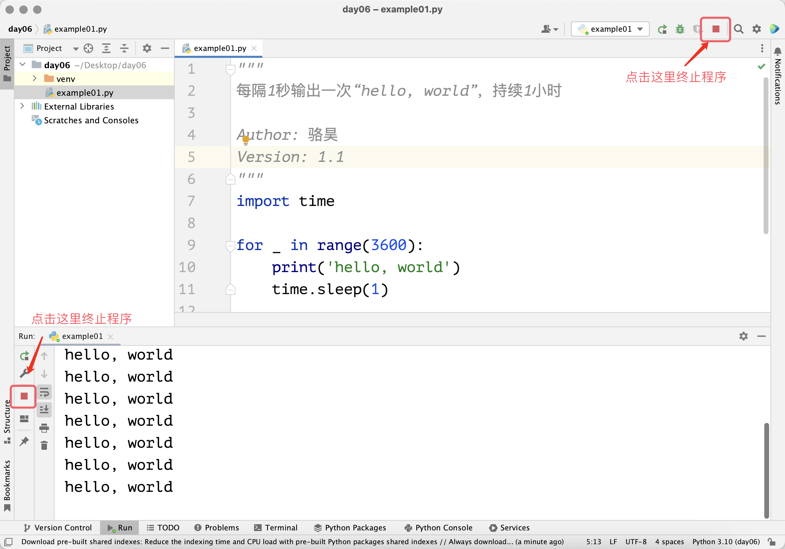

Структуры циклов
Мы при написании программ очень часто сталкиваемся со сценарием, когда нужно повторять выполнение какой-либо инструкции или набора инструкций. Например, нам нужно каждую 1 секунду выводить на экран "hello, world" на протяжении часа. Следующий код выполняет такую операцию один раз; чтобы делать это в течение часа, пришлось бы повторить код 3600 раз — готовы ли вы к такому?

python
import time

print('hello, world')
time.sleep(1)
Пояснение: функция sleep из встроенного модуля Python time приостанавливает выполнение программы. Аргумент 1 означает паузу в одну секунду, можно использовать типы int или float, например, 0.05 — это пауза 50 мс. О функциях и модулях подробнее расскажем далее.

Чтобы решить эту проблему, в Python используют структуры циклов — конструкции, позволяющие многократно выполнять инструкции. С их помощью не нужно писать одинаковый код 3600 раз — достаточно один раз поместить в цикл на 3600 итераций. В Python есть два способа построить цикл: цикл for-in и цикл while.

for-in цикл
Если заранее известно количество повторений, рекомендуется использовать цикл for-in. Например, для 3600 повторений:

python
"""
Каждую 1 секунду выводить «hello, world», в течение 1 часа

Author: Ло Хао
Version: 1.0
"""
import time

for i in range(3600):
    print('hello, world')
    time.sleep(1)
В коде выше range(3600) задаёт диапазон от 0 до 3599 — это 3600 чисел. Переменная цикла i поочерёдно принимает значения от 0 до 3599, и тело цикла выполняется 3600 раз. Вот несколько примеров использования range:

range(101) — числа от 0 до 100, 101 не включается;

range(1, 101) — числа от 1 до 100, правая граница не включается (то есть

Заметьте, в предыдущем примере переменная i не используется. В таких случаях, по соглашению, и называют её _. Исправленный вариант:

python
"""
Каждую 1 секунду выводить «hello, world», в течение 1 часа

Author: Ло Хао
Version: 1.1
"""
import time

for _ in range(3600):
    print('hello, world')
    time.sleep(1)
Код выполняется один час. Для досрочного завершения работы в PyCharm нажмите остановку, в терминале используйте сочетание Ctrl+C.

Теперь пример — сумма чисел от 1 до 100, то есть 
∑
n
=
1
100
n
∑ 
n=1
100
 n:

python
"""
Сумма чисел от 1 до 100

Version: 1.0
Author: Ло Хао
"""
total = 0
for i in range(1, 101):
    total += i
print(total)
Здесь переменная total хранит результат, переменная цикла i принимает числа от 1 до 100; каждое добавляется к total. После окончания цикла выводится окончательное значение — 5050.

Сумма чётных чисел от 1 до 100:

python
"""
Сумма чётных чисел от 1 до 100

Version: 1.0
Author: Ло Хао
"""
total = 0
for i in range(1, 101):
    if i % 2 == 0:
        total += i
print(total)
Пояснение: в этом цикле используется ветвление для проверки чётности числа.

Более простой способ — поменять шаг генерации:

python
"""
Сумма чётных чисел от 1 до 100

Version: 1.1
Author: Ло Хао
"""
total = 0
for i in range(2, 101, 2):
    total += i
print(total)
А можно использовать встроенную функцию sum без явного цикла:

python
"""
Сумма чётных чисел от 1 до 100

Version: 1.2
Author: Ло Хао
"""
print(sum(range(2, 101, 2)))
while цикл
Если число повторов заранее неизвестно, подходит цикл while. Он повторяет блок, пока выражение истинно.

Сумма чисел от 1 до 100 с помощью while:

python
"""
Сумма чисел от 1 до 100

Version: 1.1
Author: Ло Хао
"""
total = 0
i = 1
while i <= 100:
    total += i
    i += 1
print(total)
Для чётных чисел от 1 до 100:

python
"""
Сумма чётных чисел от 1 до 100

Version: 1.3
Author: Ло Хао
"""
total = 0
i = 2
while i <= 100:
    total += i
    i += 2
print(total)
break и continue
Если условие в цикле всегда истинно (while True:), получится бесконечный цикл; прерывать его можно через break. Пример:

python
"""
Сумма чётных чисел от 1 до 100

Version: 1.4
Author: Ло Хао
"""
total = 0
i = 2
while True:
    total += i
    i += 2
    if i > 100:
        break
print(total)
Аналогичная задача, использование continue (пропускает оставшийся код текущей итерации):

python
"""
Сумма чётных чисел от 1 до 100

Version: 1.5
Author: Ло Хао
"""
total = 0
for i in range(1, 101):
    if i % 2 != 0:
        continue
    total += i
print(total)
Пояснение: здесь цикл пропускает нечётные числа, только чётные используются в суммировании.

Вложенные циклы
Циклы можно вкладывать друг в друга. Например, вывод таблицы умножения:

python
"""
Печать таблицы умножения

Version: 1.0
Author: Ло Хао
"""
for i in range(1, 10):
    for j in range(1, i + 1):
        print(f'{i}×{j}={i * j}', end='\t')
    print()
Вывод:

text
1×1=1	
2×1=2	2×2=4	
3×1=3	3×2=6	3×3=9	
...
9×1=9	9×2=18	...	9×9=81
Применение циклов
Пример 1: Проверка на простое число
Условие: ввести положительное целое число > 1, определить, простое ли оно.

Подсказка: простое число > 1 делится только на 1 и само себя. Проверку делайте до 
n
n
 .

python
"""
Проверка, является ли число простым

Version: 1.0
Author: Ло Хао
"""
num = int(input('Введите положительное целое число: '))
end = int(num ** 0.5)
is_prime = True
for i in range(2, end + 1):
    if num % i == 0:
        is_prime = False
        break
if is_prime:
    print(f'{num} — простое число')
else:
    print(f'{num} — не является простым')
Пояснение: булева переменная is_prime сначала равна True — предполагаем, что число простое; если находим делитель, значение становится False.

Пример 2: Наибольший общий делитель
Условие: ввести два положительных числа, найти их наибольший общий делитель.

Подсказка: наибольший общий делитель — максимальный общий делитель.

python
"""
Наибольший общий делитель двух чисел

Version: 1.0
Author: Ло Хао
"""
x = int(input('x = '))
y = int(input('y = '))
for i in range(x, 0, -1):
    if x % i == 0 and y % i == 0:
        print(f'Наибольший общий делитель: {i}')
        break
Пояснение: переменная i убывает. Как только найден общий делитель, он и есть наибольший, цикл прерывается (break). Если числа взаимно просты — наибольший делитель равен 1.

Более быстрый вариант — алгоритм Евклида:

python
"""
Наибольший общий делитель двух чисел (Евклида)

Version: 1.1
Author: Ло Хао
"""
x = int(input('x = '))
y = int(input('y = '))
while y % x != 0:
    x, y = y % x, x
print(f'Наибольший общий делитель: {x}')
Пояснение: алгоритм Евклида быстрее, чем простой перебор.

Пример 3: Игра "Угадай число"
Компьютер случайно выбирает число от 1 до 100. Игрок угадывает, получает подсказки: "больше", "меньше", "правильно". Подсчитывается количество попыток.

python
"""
Игра 'Угадай число'

Version: 1.0
Author: Ло Хао
"""
import random

answer = random.randrange(1, 101)
counter = 0
while True:
    counter += 1
    num = int(input('Введите число: '))
    if num < answer:
        print('Больше.')
    elif num > answer:
        print('Меньше.')
    else:
        print('Угадали!')
        break
print(f'Попыток: {counter}')
Пояснение: используется модуль random, функция randrange(1, 101) — случайное число от 1 до 100. counter — счётчик попыток.

Итоги
Изучив условные и циклические структуры в Python, можно решать многие практические задачи. Для организации циклов используйте ключевые слова for, while:

Если заранее известно число повторений — цикл for

Если неизвестно — цикл while

Для принудительного выхода используйте break, для перехода к следующей итерации — continue
