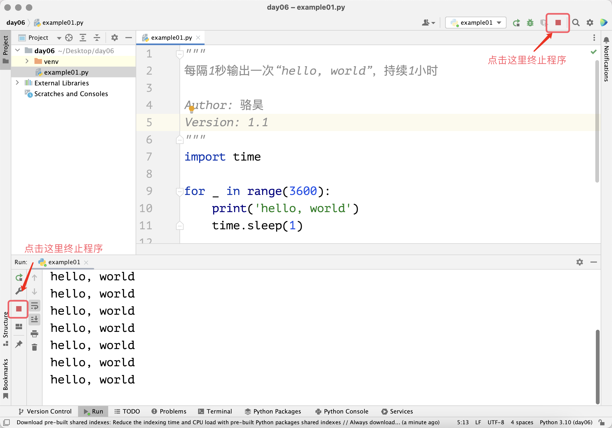

## Циклические структуры

Когда мы пишем программы, весьма вероятно, что мы столкнемся со сценарием, требующим повторного выполнения определенной команды или нескольких команд. Например, нам нужно каждую секунду выводить на экран "hello, world" в течение одного часа. Приведенный ниже код может выполнить такую операцию один раз, но если нужно продолжать вывод в течение часа, нам придется написать этот код 3600 раз. Вы готовы это сделать?

```python
import time

print('hello, world')
time.sleep(1)
```

> **Примечание**: Функция `sleep` встроенного модуля Python `time` может реализовать приостановку программы, параметр `1` означает количество секунд приостановки, можно использовать типы `int` или `float`, например `0.05` означает `50` миллисекунд. О функциях и модулях мы расскажем в последующих уроках.

Для решения проблемы в вышеописанном сценарии мы можем использовать циклическую структуру в программе Python. Так называемая циклическая структура — это структура в программе, которая управляет повторным выполнением определенной команды или команд. С такой структурой предыдущий код не нужно писать 3600 раз, а достаточно написать один раз и поместить в циклическую структуру, которая повторится 3600 раз. В языке Python есть два способа построения циклической структуры: цикл `for-in` и цикл `while`.

### Цикл for-in

Если точно известно количество повторений цикла, мы рекомендуем использовать цикл `for-in`, например, в упомянутом выше сценарии с 3600 повторениями мы можем реализовать это следующим кодом. Обратите внимание, что блок кода, управляемый циклом `for-in`, также строится с помощью отступов, это аналогично построению блоков кода в структурах ветвления. Блок кода, управляемый циклом `for-in`, мы называем телом цикла, обычно операторы в теле цикла будут повторно выполняться в соответствии с настройками цикла.

```python
"""
Каждую секунду выводить "hello, world", в течение 1 часа

Author: 骆昊
Version: 1.0
"""
import time

for i in range(3600):
    print('hello, world')
    time.sleep(1)
```

Следует отметить, что `range(3600)` в приведенном выше коде может создать диапазон от `0` до `3599`. Когда мы помещаем такой диапазон в цикл `for-in`, мы можем последовательно извлекать целые числа от `0` до `3599` через переменную цикла `i` впереди, что заставит операторы в блоке кода `for-in` повториться 3600 раз. Конечно, использование функции `range` очень гибкое, ниже приведен список примеров использования функции `range`:

- `range(101)`: может использоваться для генерации целых чисел в диапазоне от `0` до `100`, нужно отметить, что `101` не включается.
- `range(1, 101)`: может использоваться для генерации целых чисел в диапазоне от `1` до `100`, что соответствует настройке полуинтервала, закрытого слева и открытого справа, т.е. `[1, 101)`.
- `range(1, 101, 2)`: может использоваться для генерации нечетных чисел от `1` до `100`, где `2` — это шаг (приращение), т.е. значение, на которое увеличивается каждый раз, `101` не включается.
- `range(100, 0, -2)`: может использоваться для генерации четных чисел от `100` до `1`, где `-2` — это шаг (приращение), т.е. значение, на которое уменьшается каждый раз, `0` не включается.

Вы, возможно, уже заметили, что в приведенном выше коде операция вывода и операция приостановки не используют переменную цикла `i`. Для структуры цикла `for-in`, которая не требует использования переменной цикла, согласно соглашениям программирования Python, мы обычно называем переменную цикла `_`, измененный код показан ниже. Хотя результат не изменился, но так писать выглядит более профессионально, уровень мгновенно повышается.

```python
"""
Каждую секунду выводить "hello, world", в течение 1 часа

Author: 骆昊
Version: 1.1
"""
import time

for _ in range(3600):
    print('hello, world')
    time.sleep(1)
```

Приведенный выше код будет выполняться один час, если вы хотите завершить программу досрочно, в PyCharm можно нажать кнопку остановки в окне выполнения, как показано на рисунке ниже. Если вы запускаете код в командной строке или терминале, можно использовать комбинацию клавиш `ctrl+c` для завершения программы.



Далее мы используем цикл `for-in` для реализации суммирования целых чисел от 1 до 100, т.е. $\small{\sum_{n=1}^{100}{n}}$ .

```python
"""
Суммирование целых чисел от 1 до 100

Version: 1.0
Author: 骆昊
"""
total = 0
for i in range(1, 101):
    total += i
print(total)
```

В приведенном выше коде переменная `total` служит для сохранения результата накопления. В процессе цикла значение переменной цикла `i` будет изменяться от 1 до 100. Для каждого значения переменной `i` мы выполняем `total += i`, что эквивалентно `total = total + i`, этот оператор реализует операцию накопления. Таким образом, когда цикл завершится, мы выводим значение переменной `total`, её значение будет результатом суммирования от 1 до 100, равным 5050. Обратите внимание, что оператор `print(total)` не имеет отступа, он не управляется циклом `for-in` и не будет выполняться повторно.

Теперь напишем код для суммирования четных чисел от 1 до 100, как показано ниже.

```python
"""
Суммирование четных чисел от 1 до 100

Version: 1.0
Author: 骆昊
"""
total = 0
for i in range(1, 101):
    if i % 2 == 0:
        total += i
print(total)
```

> **Примечание**: В приведенном выше цикле `for-in` мы использовали структуру ветвления для проверки, является ли переменная цикла `i` четным числом.

Мы также можем изменить параметры функции `range`, установив начальное значение и шаг равным `2`, чтобы реализовать суммирование четных чисел от 1 до 100 более простым кодом.

```python
"""
Суммирование четных чисел от 1 до 100

Version: 1.1
Author: 骆昊
"""
total = 0
for i in range(2, 101, 2):
    total += i
print(total)
```

Конечно, еще более простой способ — использовать встроенную функцию Python `sum` для суммирования, так мы даже обойдемся без циклической структуры.

```python
"""
Суммирование четных чисел от 1 до 100

Version: 1.2
Author: 骆昊
"""
print(sum(range(2, 101, 2)))
```

### Цикл while

Если нужно построить циклическую структуру, но невозможно определить количество повторений цикла, мы рекомендуем использовать цикл `while`. Цикл `while` управляется булевым значением или выражением, которое производит булево значение. Когда булево значение или значение выражения равно `True`, операторы в теле цикла (блок кода с одинаковым отступом ниже оператора `while`) будут выполняться повторно, когда значение выражения становится `False`, цикл завершается.

Далее мы используем цикл `while` для реализации суммирования целых чисел от 1 до 100, код показан ниже.

```python
"""
Суммирование целых чисел от 1 до 100

Version: 1.1
Author: 骆昊
"""
total = 0
i = 1
while i <= 100:
    total += i
    i += 1
print(total)
```

По сравнению с циклом `for-in`, в приведенном выше коде мы добавили переменную `i` перед началом цикла, мы используем эту переменную для управления циклом, поэтому после `while` указано условие `i <= 100`. В теле цикла `while`, помимо накопления, нам также нужно увеличивать значение переменной `i`, поэтому мы добавили оператор `i += 1`, так значение `i` будет последовательно принимать значения 1, 2, 3, …, до 101. Когда `i` становится равным 101, условие цикла `while` больше не выполняется, код выходит из цикла `while`, в этот момент мы выводим значение переменной `total`, это результат суммирования от 1 до 100, равный 5050.

Если нужно реализовать суммирование четных чисел от 1 до 100, мы можем немного изменить приведенный выше код.

```python
"""
Суммирование четных чисел от 1 до 100

Version: 1.3
Author: 骆昊
"""
total = 0
i = 2
while i <= 100:
    total += i
    i += 2
print(total)
```

### break и continue

Что произойдет, если мы установим условие цикла `while` равным `True`, т.е. сделаем условие всегда истинным? Посмотрим на следующий код, снова используем `while` для построения циклической структуры, вычислим сумму четных чисел от 1 до 100.

```python
"""
Суммирование четных чисел от 1 до 100

Version: 1.4
Author: 骆昊
"""
total = 0
i = 2
while True:
    total += i
    i += 2
    if i > 100:
        break
print(total) 
```

В приведенном выше коде используется `while True` для создания цикла с постоянно истинным условием, что означает, что без специальной обработки цикл не завершится, это то, что мы обычно называем "бесконечным циклом". Чтобы остановить цикл, когда значение `i` превысит 100, мы использовали ключевое слово `break`, его роль — завершить выполнение циклической структуры. Нужно отметить, что `break` может завершить только тот цикл, в котором он находится, на это следует обратить внимание при использовании вложенных циклических структур, о которых мы поговорим позже. Помимо `break`, есть еще одно ключевое слово, которое можно использовать в циклических структурах — `continue`, оно может использоваться для пропуска последующего кода в текущей итерации цикла и перехода непосредственно к следующей итерации, код показан ниже.

```python
"""
Суммирование четных чисел от 1 до 100

Version: 1.5
Author: 骆昊
"""
total = 0
for i in range(1, 101):
    if i % 2 != 0:
        continue
    total += i
print(total)
```

> **Примечание**: Приведенный выше код использует ключевое слово `continue` для пропуска случаев, когда `i` является нечетным числом, только при условии, что `i` является четным числом, выполнится `total += i`.

### Вложенные циклические структуры

Как и структуры ветвления, циклические структуры также могут быть вложенными, то есть внутри циклической структуры можно построить еще одну циклическую структуру. Следующий пример демонстрирует, как вывести таблицу умножения (таблицу девяти девяток) с помощью вложенных циклов.

```python
"""
Вывод таблицы умножения

Version: 1.0
Author: 骆昊
"""
for i in range(1, 10):
    for j in range(1, i + 1):
        print(f'{i}×{j}={i * j}', end='\t')
    print()
```

В приведенном выше коде в теле цикла `for-in` снова используется цикл `for-in`, внешний цикл используется для управления выводом `i` строк, а внутренний цикл используется для управления выводом `j` столбцов в одной строке. Очевидно, что вывод внутреннего цикла `for-in` — это одна целая строка таблицы умножения. Поэтому, когда внутренний цикл завершается, мы используем `print()` для реализации эффекта перевода строки, чтобы следующий вывод начинался с новой строки, итоговый вывод выглядит следующим образом.

```
1×1=1	
2×1=2	2×2=4	
3×1=3	3×2=6	3×3=9	
4×1=4	4×2=8	4×3=12	4×4=16	
5×1=5	5×2=10	5×3=15	5×4=20	5×5=25	
6×1=6	6×2=12	6×3=18	6×4=24	6×5=30	6×6=36	
7×1=7	7×2=14	7×3=21	7×4=28	7×5=35	7×6=42	7×7=49	
8×1=8	8×2=16	8×3=24	8×4=32	8×5=40	8×6=48	8×7=56	8×8=64	
9×1=9	9×2=18	9×3=27	9×4=36	9×5=45	9×6=54	9×7=63	9×8=72	9×9=81
```

### Применение циклических структур

#### Пример 1: Определение простых чисел

Требование: Ввести положительное целое число больше 1, определить, является ли оно простым числом.

> **Подсказка**: Простые числа — это целые числа больше 1, которые делятся только на 1 и на себя. Например, для положительного целого числа $\small{n}$ мы можем определить, является ли оно простым числом, проверяя наличие делителей $\small{n}$ в диапазоне от 2 до $\small{n - 1}$. Конечно, цикл не обязательно должен начинаться с 2 и заканчиваться на $\small{n - 1}$, потому что для положительных целых чисел больше 1 делители всегда должны появляться парами, поэтому цикл можно завершить на $\small{\sqrt{n}}$.

```python
"""
Ввести положительное целое число больше 1 и определить, является ли оно простым числом

Version: 1.0
Author: 骆昊
"""
num = int(input('Пожалуйста, введите положительное целое число: '))
end = int(num ** 0.5)
is_prime = True
for i in range(2, end + 1):
    if num % i == 0:
        is_prime = False
        break
if is_prime:
    print(f'{num} является простым числом')
else:
    print(f'{num} не является простым числом')
```

> **Примечание**: В приведенном выше коде мы использовали булеву переменную `is_prime`, сначала присвоили ей значение `True`, предполагая, что `num` является простым числом; затем мы ищем делители `num` в диапазоне от 2 до `num ** 0.5`, если находим делитель `num`, то это определенно не простое число, в этот момент мы присваиваем `is_prime` значение `False`, одновременно используя ключевое слово `break` для завершения циклической структуры; наконец, мы выводим различный результат в зависимости от того, является ли значение `is_prime` равным `True` или `False`.

#### Пример 2: Наибольший общий делитель

Требование: Ввести два положительных целых числа больше 0, найти наибольший общий делитель двух чисел.

> **Подсказка**: Наибольший общий делитель двух чисел — это наибольший из общих делителей двух чисел.

```python
"""
Ввести два положительных целых числа и найти их наибольший общий делитель

Version: 1.0
Author: 骆昊
"""
x = int(input('x = '))
y = int(input('y = '))
for i in range(x, 0, -1):
    if x % i == 0 and y % i == 0:
        print(f'Наибольший общий делитель: {i}')
        break
```

> **Примечание**: В приведенном выше коде значение переменной цикла `for-in` изменяется от большего к меньшему, таким образом, найденный делитель `i`, который одновременно делит `x` и `y`, является наибольшим общим делителем `x` и `y`, в этот момент мы используем `break` для завершения цикла. Если `x` и `y` взаимно простые, то цикл выполнится до тех пор, пока `i` не станет равным 1, потому что 1 является делителем всех положительных целых чисел, в этом случае наибольший общий делитель `x` и `y` равен 1.

Использование приведенного выше кода для поиска наибольшего общего делителя имеет проблему с эффективностью выполнения. Предположим, значение `x` равно `999999999998`, а значение `y` равно `999999999999`, очевидно, что два числа взаимно простые, наибольший общий делитель равен 1. Но если мы используем приведенный выше код, цикл повторится `999999999998` раз, что обычно неприемлемо. Мы можем использовать алгоритм Евклида для поиска наибольшего общего делителя, он поможет нам быстрее получить желаемый результат, код показан ниже.

```python
"""
Ввести два положительных целых числа и найти их наибольший общий делитель

Version: 1.1
Author: 骆昊
"""
x = int(input('x = '))
y = int(input('y = '))
while y % x != 0:
    x, y = y % x, x
print(f'Наибольший общий делитель: {x}')
```

> **Примечание**: Методы и шаги решения проблемы можно назвать алгоритмом, для одной и той же проблемы мы можем разработать разные алгоритмы, различные алгоритмы будут отличаться по занимаемому пространству памяти и эффективности выполнения, и эти различия представляют качество алгоритма. Вы можете сравнить два приведенных выше фрагмента кода и понять, почему мы говорим, что алгоритм Евклида — лучший выбор. В приведенном выше коде оператор `x, y = y % x, x` означает присвоение значения `y % x` переменной `x`, а исходного значения `x` переменной `y`.

#### Пример 3: Игра в угадывание числа

Требование: Компьютер загадывает случайное число от 1 до 100, игрок вводит свое предполагаемое число, компьютер дает соответствующую подсказку "больше", "меньше" или "угадал". Если игрок угадал число, компьютер подсказывает пользователю, сколько всего попыток было сделано, игра заканчивается, иначе игра продолжается.

```python
"""
Игра в угадывание числа

Version: 1.0
Author: 骆昊
"""
import random

answer = random.randrange(1, 101)
counter = 0
while True:
    counter += 1
    num = int(input('Пожалуйста, введите: '))
    if num < answer:
        print('Больше.')
    elif num > answer:
        print('Меньше.')
    else:
        print('Угадал.')
        break
print(f'Вы угадывали {counter} раз.')
```

> **Примечание**: В приведенном выше коде используется `import random` для импорта модуля `random` из стандартной библиотеки Python, функция `randrange` этого модуля помогает нам сгенерировать случайное число в диапазоне от 1 до 100 (не включая 100). Переменная `counter` используется для записи количества выполнений цикла, то есть сколько раз игрок угадывал, при каждом выполнении цикла значение `counter` увеличивается на 1.

### Заключение

Освоив структуры ветвления и циклические структуры в Python, мы можем решать множество практических задач. Из этого урока вы должны уже знать, что можно использовать ключевые слова `for` и `while` для построения циклических структур. **Если заранее известно количество повторений циклической структуры, мы обычно используем цикл** `for`**; если количество повторений циклической структуры не может быть определено, можно использовать цикл** `while`. Кроме того, мы можем **использовать** `break` **для завершения цикла** в циклической структуре, **также можно использовать ключевое слово** `continue` **в циклической структуре, чтобы цикл сразу перешел к следующей итерации**.
