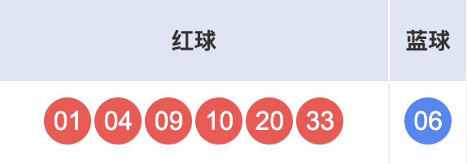
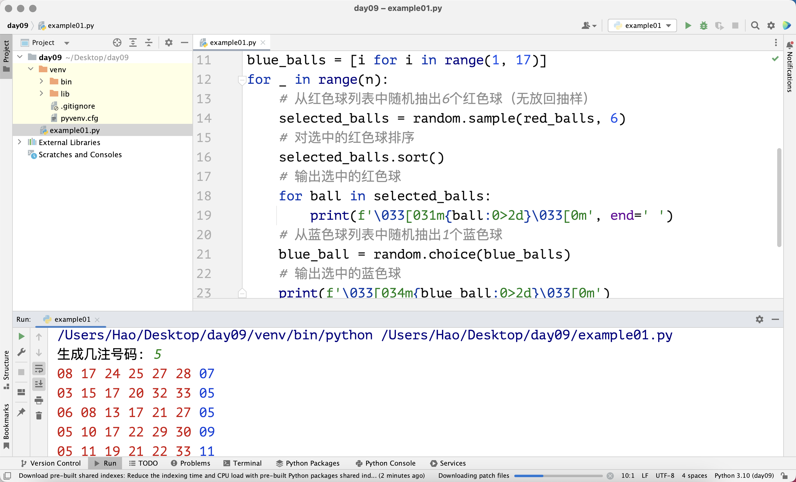
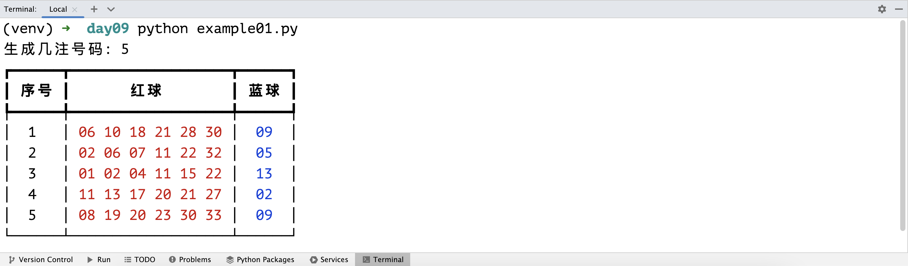

## Часто используемые структуры данных: списки-2

### Методы списков

Переменные типа список имеют множество методов, которые помогают нам оперировать списком. Предположим, у нас есть список с именем `foos`, и у списка есть метод с именем `bar`, тогда синтаксис использования метода списка: `foos.bar()` — это синтаксис вызова метода объекта через ссылку на объект. Позже, когда мы будем изучать объектно-ориентированное программирование, мы подробно объясним этот синтаксис, этот синтаксис также называется отправкой сообщения объекту.

#### Добавление и удаление элементов

Список — это изменяемый контейнер. Изменяемый контейнер означает, что мы можем добавлять элементы в контейнер, удалять элементы из контейнера, а также изменять существующие элементы контейнера. Мы можем использовать метод `append` списка для добавления элементов в конец списка, и метод `insert` для вставки элементов в список. Добавление означает добавление элемента в конец списка, а вставка — добавление нового элемента в указанную позицию. Посмотрите на код ниже.

```python
languages = ['Python', 'Java', 'C++']
languages.append('JavaScript')
print(languages)  # ['Python', 'Java', 'C++', 'JavaScript']
languages.insert(1, 'SQL')
print(languages)  # ['Python', 'SQL', 'Java', 'C++', 'JavaScript']
```

Мы можем использовать метод `remove` списка для удаления указанного элемента из списка. Нужно отметить, что если элемент, который нужно удалить, отсутствует в списке, это вызовет ошибку `ValueError`, что приведет к сбою программы, поэтому рекомендуется перед удалением элемента сначала выполнить проверку с помощью оператора принадлежности, о котором мы говорили ранее. Мы также можем использовать метод `pop` для удаления элементов из списка. Метод `pop` по умолчанию удаляет последний элемент в списке, но также можно указать позицию для удаления элемента в указанной позиции. При использовании метода `pop` для удаления элемента, если значение индекса выходит за пределы диапазона, это вызовет исключение `IndexError`, что приведет к сбою программы. Кроме того, у списка есть метод `clear`, который может очистить все элементы в списке, код показан ниже.

```python
languages = ['Python', 'SQL', 'Java', 'C++', 'JavaScript']
if 'Java' in languages:
    languages.remove('Java')
if 'Swift' in languages:
    languages.remove('Swift')
print(languages)  # ['Python', 'SQL', C++', 'JavaScript']
languages.pop()
temp = languages.pop(1)
print(temp)       # SQL
languages.append(temp)
print(languages)  # ['Python', C++', 'SQL']
languages.clear()
print(languages)  # []
```

> **Примечание**: Метод `pop` при удалении элемента возвращает удаленный элемент. В приведенном выше коде мы присвоили элемент, удаленный методом `pop`, переменной с именем `temp`. Конечно, если хотите, вы можете снова добавить этот элемент в список, как это делает код `languages.append(temp)` выше.

Здесь есть еще один небольшой вопрос: например, в списке `languages` несколько раз встречается `'Python'`, тогда при использовании `languages.remove('Python')` удаляются все `'Python'` или удаляется первый `'Python'`? Сначала попробуйте угадать, а затем попробуйте сами.

Удалить элемент из списка можно еще одним способом — использовать ключевое слово Python `del`, за которым следует элемент, который нужно удалить. Этот подход не имеет существенной разницы с использованием метода `pop` с указанием индекса для удаления элемента, но последний возвращает удаленный элемент, а первый немного превосходит по производительности, потому что `del` соответствует инструкции байт-кода `DELETE_SUBSCR`, а `pop` соответствует инструкциям байт-кода `CALL_METHOD` и `POP_TOP`. Если не понимаете, не обращайте внимания.

```python
items = ['Python', 'Java', 'C++']
del items[1]
print(items)  # ['Python', 'C++']
```

#### Позиция и частота элементов

Метод `index` списка может найти позицию индекса определенного элемента в списке. Если указанный элемент не найден, метод `index` вызовет ошибку `ValueError`. Метод `count` списка может подсчитать, сколько раз элемент встречается в списке, код показан ниже.

```python
items = ['Python', 'Java', 'Java', 'C++', 'Kotlin', 'Python']
print(items.index('Python'))     # 0
# Начать поиск 'Python' с индекса 1
print(items.index('Python', 1))  # 5
print(items.count('Python'))     # 2
print(items.count('Kotlin'))     # 1
print(items.count('Swfit'))      # 0
# Начать поиск 'Java' с индекса 3
print(items.index('Java', 3))    # ValueError: 'Java' is not in list
```

#### Сортировка и переворот элементов

Операция `sort` списка может реализовать сортировку элементов списка, а операция `reverse` может реализовать переворот элементов, код показан ниже.

```python
items = ['Python', 'Java', 'C++', 'Kotlin', 'Swift']
items.sort()
print(items)  # ['C++', 'Java', 'Kotlin', 'Python', 'Swift']
items.reverse()
print(items)  # ['Swift', 'Python', 'Kotlin', 'Java', 'C++']
```

### Генераторы списков

В Python список также может быть создан с помощью специального синтаксиса литералов, этот синтаксис называется генератором (comprehension). Далее мы объясним на примерах, какие преимущества дает использование генераторов списков при создании списков.

Сценарий первый: Создать список чисел в диапазоне от `1` до `99`, которые делятся на `3` или на `5`.

```python
items = []
for i in range(1, 100):
    if i % 3 == 0 or i % 5 == 0:
        items.append(i)
print(items)
```

Используя генератор списка для того же самого, код выглядит так:

```python
items = [i for i in range(1, 100) if i % 3 == 0 or i % 5 == 0]
print(items)
```

Сценарий второй: Есть список целых чисел `nums1`, создать новый список `nums2`, элементы `nums2` — это квадраты соответствующих элементов `nums1`.

```python
nums1 = [35, 12, 97, 64, 55]
nums2 = []
for num in nums1:
    nums2.append(num ** 2)
print(nums2)
```

Используя генератор списка для того же самого, код выглядит так:

```python
nums1 = [35, 12, 97, 64, 55]
nums2 = [num ** 2 for num in nums1]
print(nums2)
```

Сценарий третий: Есть список целых чисел `nums1`, создать новый список `nums2`, поместить в `nums2` элементы из `nums1`, которые больше `50`.

```python
nums1 = [35, 12, 97, 64, 55]
nums2 = []
for num in nums1:
    if num > 50:
        nums2.append(num)
print(nums2)
```

Используя генератор списка для того же самого, код выглядит так:

```python
nums1 = [35, 12, 97, 64, 55]
nums2 = [num for num in nums1 if num > 50]
print(nums2)
```

Использование генераторов списков для создания списков не только делает код простым и элегантным, но также превосходит по производительности использование цикла `for-in` и метода `append` для добавления элементов в пустой список. Почему генераторы имеют лучшую производительность? Это потому, что в инструкциях байт-кода интерпретатора Python есть специальная инструкция для генераторов (инструкция `LIST_APPEND`); в то время как цикл `for` добавляет элементы в список путем вызова метода (инструкции `LOAD_METHOD` и `CALL_METHOD`), а вызов метода сам по себе является относительно затратной операцией. Если не понимаете это, не страшно, просто запомните вывод: "**настоятельно рекомендуется использовать синтаксис генераторов для создания списков**".

### Вложенные списки

Язык Python не ограничивает элементы списка одним типом данных, то есть элементы в списке могут быть любого типа данных, включая сам список. Если элементы в списке также являются списками, мы можем назвать это вложенным списком. Вложенные списки могут использоваться для представления таблиц или математических матриц. Например, если мы хотим сохранить оценки 5 студентов по 3 предметам, можно использовать следующий список:

```python
scores = [[95, 83, 92], [80, 75, 82], [92, 97, 90], [80, 78, 69], [65, 66, 89]]
print(scores[0])
print(scores[0][1])
```

Для приведенного выше вложенного списка каждый элемент фактически представляет оценки одного студента по 3 предметам, например `[95, 83, 92]`, а `83` в этом списке представляет оценку этого студента по одному из предметов. Если хотите получить доступ к этому значению, можно использовать двойную индексацию `scores[0][1]`, где `scores[0]` даст список `[95, 83, 92]`, а повторная индексация `[1]` позволит получить второй элемент этого списка.

Если нужно ввести оценки 5 студентов по 3 предметам с клавиатуры и сохранить их в списке, можно использовать следующий код:

```python
scores = []
for _ in range(5):
    temp = []
    for _ in range(3):
        score = int(input('Пожалуйста, введите: '))
        temp.append(score)
    scores.append(temp)
print(scores)
```

Если нужно сгенерировать оценки 5 студентов по 3 предметам с помощью случайных чисел и сохранить их в списке, можно использовать генератор списка, код показан ниже:

```python
import random

scores = [[random.randrange(60, 101) for _ in range(3)] for _ in range(5)]
print(scores)
```

> **Примечание**: Код выше `[random.randrange(60, 101) for _ in range(3)]` может создать список из 3 случайных целых чисел. Мы поместили этот код в другой генератор списка в качестве элементов списка, таких элементов генерируется 5, в результате получается вложенный список.

### Применение списков

Далее мы объясним применение списков на примере программы случайного выбора номеров лотереи "Двойной цветной шар". Двойной цветной шар — это лотерея типа лото, выпускаемая Центром управления выпуском лотерей Китайского благотворительного фонда. Каждая ставка состоит из номеров `6` красных шаров и `1` синего шара. Номера красных шаров выбираются из чисел от `1` до `33`, номера синих шаров выбираются из чисел от `1` до `16`. Каждая ставка требует выбора `6` номеров красных шаров и `1` номера синего шара, как показано ниже.



> **Подсказка**: На Zhihu есть блестящее обсуждение сути различных форм лотерей в Китае, здесь делюсь с вами: "**Придумать человека, который получает что-то даром, чтобы обмануть группу людей, которые хотят получить что-то даром, и в конечном итоге содержать группу людей, которые действительно получают что-то даром**". Многие люди, не имеющие представления о вероятности, даже считают, что вероятность выигрыша или невыигрыша в лотерее составляет 50%; есть также много людей, которые считают, что если вероятность выигрыша составляет 1%, то покупка 100 раз обязательно приведет к выигрышу — это очень абсурдные мысли. Поэтому, **берегите жизнь, держитесь подальше от азартных игр, особенно если вы ничего не знаете о вероятности**!

Далее мы сгенерируем набор случайных номеров с помощью программы Python.

```python
"""
Программа случайного выбора номеров двойного цветного шара

Author: 骆昊
Version: 1.0
"""
import random

red_balls = list(range(1, 34))
selected_balls = []
# Добавить 6 красных шаров в список выбранных
for _ in range(6):
    # Генерировать случайное целое число, представляющее позицию индекса выбранного красного шара
    index = random.randrange(len(red_balls))
    # Удалить выбранный шар из списка красных шаров и добавить в список выбранных
    selected_balls.append(red_balls.pop(index))
# Отсортировать выбранные красные шары
selected_balls.sort()
# Вывести выбранные красные шары
for ball in selected_balls:
    print(f'\033[031m{ball:0>2d}\033[0m', end=' ')
# Случайно выбрать 1 синий шар
blue_ball = random.randrange(1, 17)
# Вывести выбранный синий шар
print(f'\033[034m{blue_ball:0>2d}\033[0m')
```

> **Примечание**: В коде выше `print(f'\033[0m...\033[0m')` используется для управления цветом вывода, красные шары выводятся красным цветом, синий шар — синим цветом. Здесь многоточие представляет содержимое, которое мы хотим вывести, `\033[0m` — это управляющий код, означающий отключение всех атрибутов, то есть предыдущий управляющий код станет недействительным. Вы также можете просто понимать это как разделитель. `0` перед `m` означает, что режим отображения консоли установлен на значение по умолчанию, `0` можно опустить, `1` означает выделение, `5` означает мигание, `7` означает инверсию и т.д. Между `0` и `m` мы можем написать числа, представляющие цвета, например `30` — черный, `31` — красный, `32` — зеленый, `33` — желтый, `34` — синий и т.д.

Мы также можем использовать функции `sample` и `choice` из модуля `random` для упрощения приведенного выше кода. Первая реализует случайную выборку без возврата, вторая — случайный выбор одного элемента. Измененный код выглядит следующим образом:

```python
"""
Программа случайного выбора номеров двойного цветного шара

Author: 骆昊
Version: 1.1
"""
import random

red_balls = [i for i in range(1, 34)]
blue_balls = [i for i in range(1, 17)]
# Из списка красных шаров случайно выбрать 6 красных шаров (выборка без возврата)
selected_balls = random.sample(red_balls, 6)
# Отсортировать выбранные красные шары
selected_balls.sort()
# Вывести выбранные красные шары
for ball in selected_balls:
    print(f'\033[031m{ball:0>2d}\033[0m', end=' ')
# Из списка синих шаров случайно выбрать 1 синий шар
blue_ball = random.choice(blue_balls)
# Вывести выбранный синий шар
print(f'\033[034m{blue_ball:0>2d}\033[0m')
```

Если нужно реализовать случайную генерацию `N` ставок, нам просто нужно поместить приведенный выше код в цикл, повторяющийся `N` раз, как показано ниже:

```python
"""
Программа случайного выбора номеров двойного цветного шара

Author: 骆昊
Version: 1.2
"""
import random

n = int(input('Сгенерировать сколько ставок: '))
red_balls = [i for i in range(1, 34)]
blue_balls = [i for i in range(1, 17)]
for _ in range(n):
    # Из списка красных шаров случайно выбрать 6 красных шаров (выборка без возврата)
    selected_balls = random.sample(red_balls, 6)
    # Отсортировать выбранные красные шары
    selected_balls.sort()
    # Вывести выбранные красные шары
    for ball in selected_balls:
        print(f'\033[031m{ball:0>2d}\033[0m', end=' ')
    # Из списка синих шаров случайно выбрать 1 синий шар
    blue_ball = random.choice(blue_balls)
    # Вывести выбранный синий шар
    print(f'\033[034m{blue_ball:0>2d}\033[0m')
```

Если мы запустим приведенный выше код в PyCharm, введем `5`, результат работы будет выглядеть как на рисунке ниже.



Здесь заодно познакомим вас со сторонней библиотекой Python под названием rich, которая может помочь нам создать самый красивый вывод самым простым способом. Вы можете установить эту стороннюю библиотеку в терминале с помощью инструмента управления пакетами Python pip. Для пользователей PyCharm, конечно, следует использовать команду pip в окне терминала PyCharm для установки rich в виртуальную среду проекта, команда выглядит следующим образом:

```bash
pip install rich
```


Как показано на рисунке выше, после успешной установки rich мы можем использовать следующий код для управления выводом:

```python
"""
Программа случайного выбора номеров двойного цветного шара

Author: 骆昊
Version: 1.3
"""
import random

from rich.console import Console
from rich.table import Table

# Создать консоль
console = Console()

n = int(input('Сгенерировать сколько ставок: '))
red_balls = [i for i in range(1, 34)]
blue_balls = [i for i in range(1, 17)]

# Создать таблицу и добавить заголовки
table = Table(show_header=True)
for col_name in ('Номер', 'Красные шары', 'Синий шар'):
    table.add_column(col_name, justify='center')

for i in range(n):
    selected_balls = random.sample(red_balls, 6)
    selected_balls.sort()
    blue_ball = random.choice(blue_balls)
    # Добавить строку в таблицу (номер, красные шары, синий шар)
    table.add_row(
        str(i + 1),
        f'[red]{" ".join([f"{ball:0>2d}" for ball in selected_balls])}[/red]',
        f'[blue]{blue_ball:0>2d}[/blue]'
    )

# Вывести таблицу через консоль
console.print(table)
```

> **Примечание**: В строке 31 приведенного выше кода используется синтаксис генератора списка для обработки номеров красных шаров в строки и сохранения их в списке, `" ".join([...])` соединяет несколько строк в списке пробелом в одну полную строку. Если не понимаете, можно пока отложить. `[red]...[/red]` в строке используется для установки цвета вывода на красный, `[blue]...[/blue]` в строке 32 устанавливает цвет вывода на синий. Больше информации о библиотеке rich можно найти в [официальной документации](https://github.com/textualize/rich/blob/master/README.cn.md).

Итоговый вывод выглядит как на рисунке ниже. Глядя на такой вывод, разве настроение не становится немного лучше?



### Заключение

Список в Python в основе представляет собой массив с динамическим расширением, элементы списка хранятся в памяти компьютера последовательно, поэтому можно реализовать случайный доступ (получить соответствующий элемент через действительный индекс, причем время операции не зависит от количества элементов списка). Мы можем пока не углубляться в эти детали хранения на низком уровне, и не нужно понимать асимптотическую временную сложность каждого метода списка (отношение между временем выполнения метода и количеством элементов списка). Сначала научитесь использовать списки для решения проблем в работе — думаю, это важнее.
