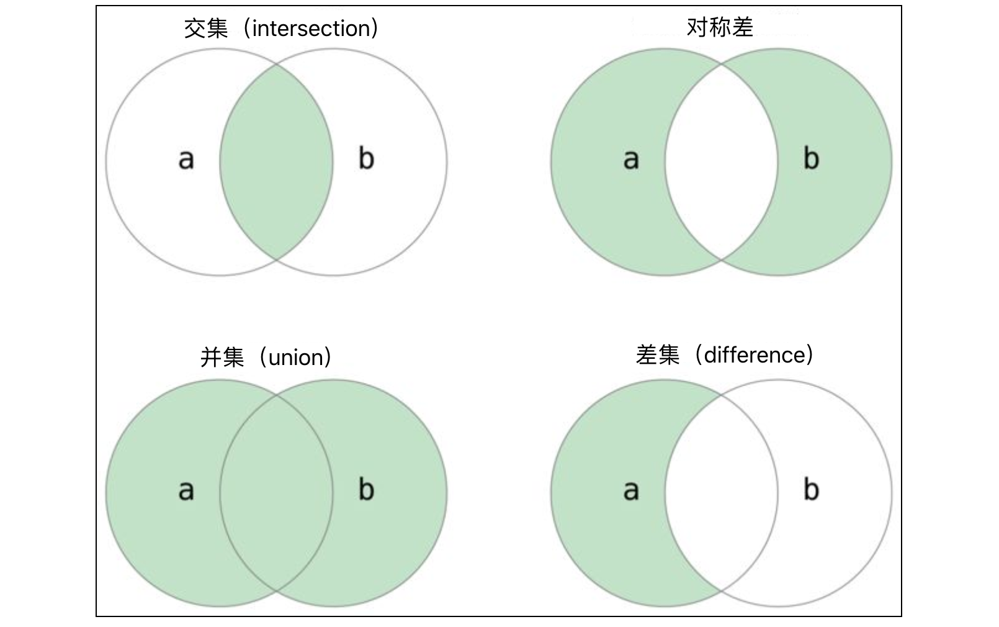

## Часто используемые структуры данных: множества

После изучения списков и кортежей мы переходим к изучению еще одного контейнерного типа данных, его название — множество (set). Говоря о слове "множество", вы наверняка с ним знакомы, эта концепция есть в учебниках математики. Если мы **рассматриваем определенный диапазон, конкретные, различимые вещи как единое целое**, то это целое является множеством, а различные вещи в множестве называются **элементами** множества. Обычно множество должно удовлетворять следующим требованиям:

1. **Неупорядоченность**: В множестве все элементы равны, между элементами нет порядка.
2. **Уникальность**: В множестве любые два элемента различны, то есть элемент может появиться в множестве только один раз.
3. **Определенность**: Для данного множества и любого элемента этот элемент либо принадлежит этому множеству, либо не принадлежит, должен быть один из двух вариантов, не допускается неопределенность.

Множество в программах Python не имеет существенных отличий от множества в математике. Нужно подчеркнуть упомянутые выше неупорядоченность и уникальность. Неупорядоченность означает, что элементы в множестве не имеют определенного порядка, как элементы списка, и не могут быть доступны по индексу. **Множество не поддерживает операцию индексации**. Кроме того, уникальность множества определяет, что **в множестве не может быть повторяющихся элементов**, это также отличает множество от списка, мы не можем добавить повторяющиеся элементы в множество. Тип множества, безусловно, поддерживает операции принадлежности `in` и `not in`, таким образом можно определить, принадлежит ли элемент множеству, это и есть упомянутая выше определенность множества. **Операция принадлежности в множестве превосходит по производительности операцию принадлежности в списке**, это определяется характеристиками хранения множества на низком уровне, здесь мы временно не будем обсуждать это, просто запомните этот вывод.

> **Примечание**: В основе множества используется хеш-хранилище (散列存储). Для читателей, незнакомых с хеш-хранилищем, можно сначала посмотреть объяснение [хеш-таблиц](https://www.hello-algo.com/chapter_hashing/) на сайте "Hello 算法", спасибо автору за открытый исходный код.

### Создание множеств

В Python создание множества можно выполнить с использованием синтаксиса литерала `{}`, в `{}` должен быть хотя бы один элемент, потому что пустые `{}` представляют не пустое множество, а пустой словарь. Тип словаря мы познакомим вас на следующем уроке. Конечно, также можно использовать встроенную функцию Python `set` для создания множества. Точнее говоря, `set` — это не функция, а конструктор для создания объектов множества, эта тема будет представлена позже, когда мы будем изучать объектно-ориентированное программирование. Мы можем использовать функцию `set` для создания пустого множества, также можно использовать её для преобразования других последовательностей в множества, например: `set('hello')` даст множество, содержащее `4` символа (повторяющийся символ `l` появится в множестве только один раз). Помимо этих двух способов, можно также использовать синтаксис генераторов для создания множества, так же как мы раньше использовали синтаксис генераторов для создания списков.

```python
set1 = {1, 2, 3, 3, 3, 2}
print(set1)

set2 = {'banana', 'pitaya', 'apple', 'apple', 'banana', 'grape'}
print(set2)

set3 = set('hello')
print(set3)

set4 = set([1, 2, 2, 3, 3, 3, 2, 1])
print(set4)

set5 = {num for num in range(1, 20) if num % 3 == 0 or num % 7 == 0}
print(set5)
```

Нужно напомнить, что элементы в множестве должны быть типа `hashable`. Тип `hashable` означает тип данных, для которого можно вычислить хеш-код. Обычно все неизменяемые типы являются `hashable`, такие как целые числа (`int`), числа с плавающей точкой (`float`), булевы значения (`bool`), строки (`str`), кортежи (`tuple`) и т.д. Все изменяемые типы не являются `hashable`, потому что для изменяемых типов невозможно вычислить определенный хеш-код, поэтому их нельзя поместить в множество. Например: мы не можем использовать список в качестве элемента множества; аналогично, поскольку само множество также является изменяемым типом, множество также не может быть элементом множества. Мы можем создать вложенные списки (элементы списка также являются списками), но мы не можем создать вложенные множества, на это нужно обязательно обратить внимание при использовании множеств.

> **Совет**: Если не понимаете упомянутые выше концепции хеш-кода, хеш-хранилища, можно пока отложить, потому что это не мешает вам продолжать изучать и использовать язык Python. Конечно, если вы студент специальности компьютерных наук, непонимание хеш-хранилища простить трудно, нужно срочно восполнить пробелы.

### Обход элементов

Мы можем использовать функцию `len` для получения количества элементов в множестве, но мы не можем использовать операцию индексации для обхода элементов множества, потому что элементы множества не имеют определенного порядка. Конечно, для реализации обхода элементов множества мы все еще можем использовать цикл `for-in`, код показан ниже.

```python
set1 = {'Python', 'C++', 'Java', 'Kotlin', 'Swift'}
for elem in set1:
    print(elem)
```

> **Подсказка**: Посмотрите на результат выполнения приведенного выше кода, по порядку вывода слов почувствуйте неупорядоченность множества.

### Операции с множествами

Python предоставляет очень богатый набор операций для типа множество, включая: операцию принадлежности, операцию пересечения, операцию объединения, операцию разности, операцию сравнения (равенство, подмножество, надмножество) и т.д.

#### Операция принадлежности

Можно проверить, находится ли элемент в множестве, с помощью операций принадлежности `in` и `not in`, код показан ниже.

```python
set1 = {11, 12, 13, 14, 15}
print(10 in set1)      # False 
print(15 in set1)      # True
set2 = {'Python', 'Java', 'C++', 'Swift'}
print('Ruby' in set2)  # False
print('Java' in set2)  # True
```

#### Бинарные операции

Бинарные операции множеств в основном включают операции пересечения, объединения, разности, симметрической разности и т.д. Эти операции можно реализовать с помощью операторов, а также с помощью методов типа множество, код показан ниже.



```python
set1 = {1, 2, 3, 4, 5, 6, 7}
set2 = {2, 4, 6, 8, 10}

# Пересечение
print(set1 & set2)                      # {2, 4, 6}
print(set1.intersection(set2))          # {2, 4, 6}

# Объединение
print(set1 | set2)                      # {1, 2, 3, 4, 5, 6, 7, 8, 10}
print(set1.union(set2))                 # {1, 2, 3, 4, 5, 6, 7, 8, 10}

# Разность
print(set1 - set2)                      # {1, 3, 5, 7}
print(set1.difference(set2))            # {1, 3, 5, 7}

# Симметрическая разность
print(set1 ^ set2)                      # {1, 3, 5, 7, 8, 10}
print(set1.symmetric_difference(set2))  # {1, 3, 5, 7, 8, 10}
```

Из приведенного выше кода видно, что для нахождения пересечения двух множеств оператор `&` и метод `intersection` работают совершенно одинаково, использование оператора, очевидно, более интуитивно и код короче. Следует отметить, что бинарные операции множеств также можно объединить с операцией присваивания для образования составной операции присваивания, например: `set1 |= set2` эквивалентно `set1 = set1 | set2`, метод, действующий аналогично `|=`, — это `update`; `set1 &= set2` эквивалентно `set1 = set1 & set2`, метод, действующий аналогично `&=`, — это `intersection_update`, код показан ниже.

```python
set1 = {1, 3, 5, 7}
set2 = {2, 4, 6}
set1 |= set2
# set1.update(set2)
print(set1)  # {1, 2, 3, 4, 5, 6, 7}
set3 = {3, 6, 9}
set1 &= set3
# set1.intersection_update(set3)
print(set1)  # {3, 6}
set2 -= set1
# set2.difference_update(set1)
print(set2)  # {2, 4}
```

#### Операции сравнения

Два множества можно сравнивать на равенство с помощью `==` и `!=`. Если элементы в двух множествах полностью одинаковы, то результат сравнения `==` будет `True`, иначе — `False`. Если любой элемент множества `A` является элементом множества `B`, то множество `A` называется подмножеством множества `B`, то есть для $\small{\forall{a} \in {A}}$ верно $\small{{a} \in {B}}$, тогда $\small{{A} \subseteq {B}}$, `A` является подмножеством `B`, наоборот, также можно сказать, что `B` является надмножеством `A`. Если `A` является подмножеством `B` и `A` не равно `B`, то `A` является собственным подмножеством `B`. Python предоставляет операторы для определения подмножества и надмножества для типа множество, это знакомые нам операторы `<`, `<=`, `>`, `>=`. Конечно, мы также можем использовать методы типа множество `issubset` и `issuperset` для определения отношений между множествами, код показан ниже.

```python
set1 = {1, 3, 5}
set2 = {1, 2, 3, 4, 5}
set3 = {5, 4, 3, 2, 1}

print(set1 < set2)   # True
print(set1 <= set2)  # True
print(set2 < set3)   # False
print(set2 <= set3)  # True
print(set2 > set1)   # True
print(set2 == set3)  # True

print(set1.issubset(set2))    # True
print(set2.issuperset(set1))  # True
```

> **Примечание**: В приведенном выше коде `set1 < set2` проверяет, является ли `set1` собственным подмножеством `set2`, `set1 <= set2` проверяет, является ли `set1` подмножеством `set2`, `set2 > set1` проверяет, является ли `set2` надмножеством `set1`. Конечно, мы также можем использовать `set1.issubset(set2)` для проверки, является ли `set1` подмножеством `set2`; использовать `set2.issuperset(set1)` для проверки, является ли `set2` надмножеством `set1`.

### Методы множеств

Как мы уже говорили, множество в Python — это изменяемый тип, мы можем добавлять элементы в множество или удалять элементы из множества с помощью методов множества.

```python
set1 = {1, 10, 100}

# Добавить элемент
set1.add(1000)
set1.add(10000)
print(set1)  # {1, 100, 1000, 10, 10000}

# Удалить элемент
set1.discard(10)
if 100 in set1:
    set1.remove(100)
print(set1)  # {1, 1000, 10000}

# Очистить элементы
set1.clear()
print(set1)  # set()
```

> **Примечание**: Метод удаления элемента `remove` вызывает ошибку `KeyError`, если элемент не существует, поэтому в приведенном выше коде мы сначала проверяем через операцию принадлежности, находится ли элемент в множестве. У типа множество также есть метод `pop`, который может удалить случайный элемент из множества, этот метод при удалении элемента возвращает (получает) удаленный элемент, а методы `remove` и `discard` только удаляют элемент, не возвращая (не получая) удаленный элемент.

У типа множество также есть метод `isdisjoint`, который может проверить, есть ли у двух множеств одинаковые элементы. Если нет одинаковых элементов, этот метод возвращает `True`, иначе возвращает `False`, код показан ниже.

```python
set1 = {'Java', 'Python', 'C++', 'Kotlin'}
set2 = {'Kotlin', 'Swift', 'Java', 'Dart'}
set3 = {'HTML', 'CSS', 'JavaScript'}
print(set1.isdisjoint(set2))  # False
print(set1.isdisjoint(set3))  # True
```

### Неизменяемое множество

В Python есть также неизменяемый тип множества, называемый `frozenset`. Разница между `set` и `frozenset` такая же, как между `list` и `tuple`. Поскольку `frozenset` — это неизменяемый тип, для него можно вычислить хеш-код, поэтому он может быть элементом `set`. Помимо невозможности добавлять и удалять элементы, `frozenset` в остальном аналогичен `set`, приведенный ниже код демонстрирует простое использование `frozenset`.

```python
fset1 = frozenset({1, 3, 5, 7})
fset2 = frozenset(range(1, 6))
print(fset1)          # frozenset({1, 3, 5, 7})
print(fset2)          # frozenset({1, 2, 3, 4, 5})
print(fset1 & fset2)  # frozenset({1, 3, 5})
print(fset1 | fset2)  # frozenset({1, 2, 3, 4, 5, 7})
print(fset1 - fset2)  # frozenset({7})
print(fset1 < fset2)  # False
```

### Заключение

**Тип множество в Python — это неупорядоченный контейнер**, **не допускающий повторяющихся элементов**. Поскольку в основе используется хеш-хранилище, элементы в множестве должны быть типа `hashable`. Самая большая разница между множеством и списком в том, что **элементы в множестве не имеют порядка**, поэтому **невозможно получить доступ к элементам через операцию индексации**, но множество может выполнять бинарные операции, такие как пересечение, объединение, разность, а также может проверять отношения между двумя множествами, такие как надмножество, подмножество и т.д., с помощью операторов сравнения.