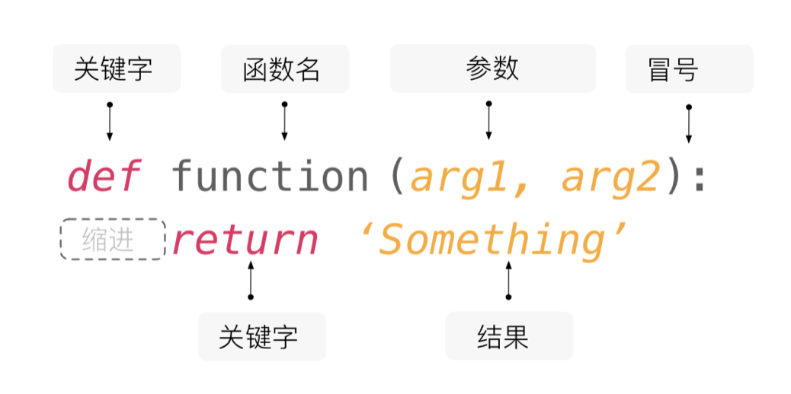

## Функции и модули

Перед тем как объяснить содержание этого урока, давайте сначала рассмотрим математическую задачу: скажите, сколько решений в положительных целых числах имеет следующее уравнение.

$$
x_{1} + x_{2} + x_{3} + x_{4} = 8
$$

Вы, возможно, уже догадались, что эта задача на самом деле эквивалентна вопросу о том, сколькими способами можно разделить 8 яблок на четыре группы, при этом в каждой группе должно быть хотя бы одно яблоко, что также эквивалентно размещению трех разделителей в 7 промежутках между 8 яблоками для разделения яблок на четыре группы, поэтому ответ $\small{C_{7}^{3} = 35}$, где $\small{C_{7}^{3}}$ представляет количество сочетаний из 7 по 3, формула вычисления следующая.

$$
C_m^n = \frac {m!} {n!(m-n)!}
$$

Основываясь на ранее изученных знаниях, мы можем использовать циклы для вычисления произведений и отдельно вычислить $\small{m!}$, $\small{n!}$ и $\small{(m-n)!}$, затем через операцию деления получить количество сочетаний $\small{C_{m}^{n}}$, код показан ниже.

```python
"""
Ввести m и n, вычислить значение количества сочетаний C(m,n)

Version: 1.0
Author: 骆昊
"""

m = int(input('m = '))
n = int(input('n = '))
# Вычислить факториал m
fm = 1
for num in range(1, m + 1):
    fm *= num
# Вычислить факториал n
fn = 1
for num in range(1, n + 1):
    fn *= num
# Вычислить факториал m-n
fk = 1
for num in range(1, m - n + 1):
    fk *= num
# Вычислить значение C(M,N)
print(fm // fn // fk)
```

Ввод:

```
m = 7
n = 3
```

Вывод:

```
35
```

Не знаю, заметили ли вы, что в приведенном выше коде мы трижды выполнили операцию вычисления факториала. Хотя значения $\small{m}$, $\small{n}$, $\small{m - n}$ различны, три фрагмента кода не имеют существенных различий и являются повторяющимся кодом. Всемирно известный мастер программирования *Martin Fowler* однажды сказал: "**У кода есть много плохих запахов, повторение — самый худший из них!**". Чтобы написать высококачественный код, в первую очередь нужно решить проблему повторяющегося кода. Для приведенного выше кода мы можем инкапсулировать функциональность вычисления факториала в блок кода, называемый "функцией", и в местах, где нужно вычислить факториал, нам достаточно "вызвать функцию", чтобы реализовать повторное использование функциональности вычисления факториала.

### Определение функций

Математические функции обычно имеют вид $\small{y = f(x)}$ или $\small{z = g(x, y)}$. В $\small{y = f(x)}$ $\small{f}$ — это имя функции, $\small{x}$ — независимая переменная функции, $\small{y}$ — зависимая переменная функции; а в $\small{z = g(x, y)}$ $\small{g}$ — имя функции, $\small{x}$ и $\small{y}$ — независимые переменные функции, $\small{z}$ — зависимая переменная функции. Функции в Python соответствуют этой структуре: каждая функция имеет свое имя, независимые переменные и зависимую переменную. Обычно мы называем независимые переменные функции Python параметрами функции, а зависимую переменную — возвращаемым значением функции.

В Python можно использовать ключевое слово `def` для определения функции. Как и переменные, каждая функция также должна иметь красивое имя, правила именования такие же, как правила именования переменных (быстро вспомните правила именования переменных, которые мы обсуждали ранее). В круглых скобках после имени функции можно задать параметры функции, то есть независимые переменные, о которых мы только что говорили, а после завершения выполнения функции мы используем ключевое слово `return` для возврата результата выполнения функции — это зависимая переменная, о которой мы только что говорили. Если в функции нет оператора `return`, функция вернет `None`, представляющий пустое значение. Кроме того, функция может не иметь независимых переменных (параметров), но круглые скобки после имени функции обязательны. То, что должна делать функция (код для выполнения), помещается через отступы после строки определения функции, аналогично блокам кода в структурах ветвления и циклах, как показано на рисунке ниже.



Далее мы поместим операцию вычисления факториала из предыдущего кода в функцию, чтобы таким образом рефакторить код выше. **Рефакторинг — это корректировка структуры кода без влияния на результаты выполнения кода**, код после рефакторинга показан ниже.

```python
"""
Ввести m и n, вычислить значение количества сочетаний C(m,n)

Version: 1.1
Author: 骆昊
"""


# Определить функцию вычисления факториала через ключевое слово def
# Независимая переменная (параметр) num — неотрицательное целое число
# Зависимая переменная (возвращаемое значение) — факториал num
def fac(num):
    result = 1
    for n in range(2, num + 1):
        result *= n
    return result


m = int(input('m = '))
n = int(input('n = '))
# При вычислении факториала не нужно писать повторяющийся код, а достаточно вызвать функцию
# Синтаксис вызова функции — имя функции с круглыми скобками и передачей параметров
print(fac(m) // fac(n) // fac(m - n))
```

Вы можете почувствовать, что приведенный выше код проще и элегантнее предыдущей версии. Что еще важнее, определенная нами функция вычисления факториала `fac` может быть повторно использована в другом коде, где нужно вычислить факториал. Таким образом, **использование функций помогает нам инкапсулировать код, который функционально относительно независим и будет повторно использоваться**. Когда нам нужен этот код, мы не пишем повторяющийся код снова, а **через вызов функции реализуем повторное использование существующего кода**. Фактически, в модуле `math` стандартной библиотеки Python уже есть функция `factorial`, реализующая функциональность вычисления факториала. Мы можем напрямую импортировать модуль `math` с помощью `import math`, затем использовать `math.factorial` для вызова функции вычисления факториала; мы также можем напрямую импортировать функцию `factorial` через `from math import factorial`, код показан ниже.

```python
"""
Ввести m и n, вычислить значение количества сочетаний C(m,n)

Version: 1.2
Author: 骆昊
"""
from math import factorial

m = int(input('m = '))
n = int(input('n = '))
print(factorial(m) // factorial(n) // factorial(m - n))
```

В будущем функции, которые мы используем, будут либо пользовательскими, либо предоставленными стандартной библиотекой Python или сторонними библиотеками. Если уже есть готовая функция, нам не нужно определять свою, "**изобретение велосипеда заново**" — это очень плохо. Для приведенного выше кода, если вы считаете, что имя `factorial` слишком длинное и писать код не очень удобно, при импорте функции можно также использовать ключевое слово `as` для создания псевдонима. При вызове функции мы можем использовать псевдоним функции, а не её прежнее имя, код показан ниже.

```python
"""
Ввести m и n, вычислить значение количества сочетаний C(m,n)

Version: 1.3
Author: 骆昊
"""
from math import factorial as f

m = int(input('m = '))
n = int(input('n = '))
print(f(m) // f(n) // f(m - n))
```

### Параметры функций

#### Позиционные параметры и ключевые параметры

Напишем еще одну функцию, которая по трем заданным длинам сторон определяет, могут ли они образовать треугольник. Если могут образовать треугольник, функция возвращает `True`, иначе возвращает `False`, код показан ниже.

```python
def make_judgement(a, b, c):
    """Определить, могут ли три стороны образовать треугольник"""
    return a + b > c and b + c > a and a + c > b
```

У функции `make_judgement` выше три параметра, такие параметры называются позиционными параметрами. При вызове функции обычно передаются слева направо по порядку, и количество переданных параметров должно совпадать с количеством параметров при определении функции, как показано ниже.

```python
print(make_judgement(1, 2, 3))  # False
print(make_judgement(4, 5, 6))  # True
```

Если не хотите передавать значения трех параметров `a`, `b`, `c` по порядку слева направо, можно также использовать ключевые параметры, передавая параметры функции в форме "имя_параметра=значение_параметра", как показано ниже.

```python
print(make_judgement(b=2, c=3, a=1))  # False
print(make_judgement(c=6, b=4, a=5))  # True
```

При определении функции мы можем использовать `/` в списке параметров для установки **строго позиционных параметров** (*positional-only arguments*), использовать `*` для установки **именованных ключевых параметров**. Строго позиционные параметры — это параметры, при вызове функции которые могут получать значения только по позиции параметра; а именованные ключевые параметры могут передаваться и получаться только через форму "имя_параметра=значение_параметра", посмотрите на следующий пример.

```python
# Параметры перед / — строго позиционные параметры
def make_judgement(a, b, c, /):
    """Определить, могут ли три стороны образовать треугольник"""
    return a + b > c and b + c > a and a + c > b


# Следующий код вызовет ошибку TypeError с сообщением "строго позиционные параметры не допускают указания имени параметра"
# TypeError: make_judgement() got some positional-only arguments passed as keyword arguments
# print(make_judgement(b=2, c=3, a=1))
```

> **Примечание**: Строго позиционные параметры — это новая функция, введенная в Python 3.8, при использовании более ранних версий интерпретатора Python нужно это учитывать.

```python
# Параметры после * — именованные ключевые параметры
def make_judgement(*, a, b, c):
    """Определить, могут ли три стороны образовать треугольник"""
    return a + b > c and b + c > a and a + c > b


# Следующий код вызовет ошибку TypeError с сообщением "функция не принимает позиционных параметров, но было передано 3 позиционных параметра"
# TypeError: make_judgement() takes 0 positional arguments but 3 were given
# print(make_judgement(1, 2, 3))
```

#### Значения параметров по умолчанию

В Python параметры функции могут иметь значения по умолчанию. Мы можем инкапсулировать функциональность получения очков при броске костей из ранее рассмотренного примера "Игра в CRAPS" (《Урок 07: Применение структур ветвления и циклов》) в функцию, код показан ниже.

```python
from random import randrange


# Определить функцию броска костей
# Независимая переменная (параметр) n функции представляет количество костей, значение по умолчанию 2
# Зависимая переменная (возвращаемое значение) представляет количество очков от броска n костей
def roll_dice(n=2):
    total = 0
    for _ in range(n):
        total += randrange(1, 7)
    return total


# Если параметр не указан, n использует значение по умолчанию 2, что означает бросок двух костей
print(roll_dice())
# Передать параметр 3, переменная n получит значение 3, что означает бросок трех костей для получения очков
print(roll_dice(3))
```

Рассмотрим еще более простой пример.

```python
def add(a=0, b=0, c=0):
    """Сложить три числа"""
    return a + b + c


# Вызвать функцию add без передачи параметров, тогда a, b, c все используют значение по умолчанию 0
print(add())         # 0
# Вызвать функцию add, передав один параметр, этот параметр присваивается переменной a, переменные b и c используют значение по умолчанию 0
print(add(1))        # 1
# Вызвать функцию add, передав два параметра, они присваиваются переменным a и b, переменная c использует значение по умолчанию 0
print(add(1, 2))     # 3
# Вызвать функцию add, передав три параметра, они присваиваются переменным a, b, c
print(add(1, 2, 3))  # 6
```

Нужно обратить внимание, что **параметры со значениями по умолчанию должны располагаться после параметров без значений по умолчанию**, иначе возникнет ошибка `SyntaxError` с сообщением: `non-default argument follows default argument`, что в переводе на русский означает "параметр без значения по умолчанию расположен после параметра со значением по умолчанию".

#### Переменное количество параметров

В языке Python с помощью синтаксиса звездочки можно заставить функцию поддерживать переменное количество параметров. Переменное количество параметров означает, что при вызове функции можно передать `0` или любое количество параметров. Когда мы в будущем разрабатываем коммерческие проекты в командной работе, весьма вероятно, что нам придется разрабатывать функции для использования другими людьми, но иногда мы не знаем, сколько параметров передаст вызывающий функцию. В таких случаях переменное количество параметров может пригодиться.

Следующий код демонстрирует, как использовать переменные позиционные параметры для реализации функции `add`, которая суммирует любое количество чисел. При вызове функции переданные параметры сохраняются в кортеж, через обход этого кортежа можно получить переданные в функцию параметры.

```python
# Выражение со звездочкой означает, что args может принять 0 или любое количество параметров
# При вызове функции переданные n параметров будут собраны в n-элементный кортеж и присвоены args
# Если не передано ни одного параметра, args будет пустым кортежем
def add(*args):
    total = 0
    # Циклический обход кортежа, содержащего переменные параметры
    for val in args:
        # Выполнена проверка типа параметра (только числовые могут суммироваться)
        if type(val) in (int, float):
            total += val
    return total


# При вызове функции add можно передать 0 или любое количество параметров
print(add())         # 0
print(add(1))        # 1
print(add(1, 2, 3))  # 6
print(add(1, 2, 'hello', 3.45, 6))  # 12.45
```

Если мы хотим передавать несколько параметров в форме "имя_параметра=значение_параметра", и точное количество параметров также неизвестно, мы можем добавить к функции переменные ключевые параметры, собрав переданные ключевые параметры в словарь, код показан ниже.

```python
# **kwargs в списке параметров может принять 0 или любое количество ключевых параметров
# При вызове функции переданные ключевые параметры будут собраны в словарь (имя параметра — ключ в словаре, значение параметра — значение в словаре)
# Если не передано ни одного ключевого параметра, kwargs будет пустым словарем
def foo(*args, **kwargs):
    print(args)
    print(kwargs)


foo(3, 2.1, True, name='骆昊', age=43, gpa=4.95)
```

Вывод:

```
(3, 2.1, True)
{'name': '骆昊', 'age': 43, 'gpa': 4.95}
```

### Управление функциями с помощью модулей

Независимо от того, на каком языке программирования пишется код, именование переменных и функций всегда является головной болью, потому что мы можем столкнуться с неловкой ситуацией **конфликта имен**. Простейший сценарий — в одном `.py` файле определены две функции с одинаковым именем, как показано ниже.

```python
def foo():
    print('hello, world!')


def foo():
    print('goodbye, world!')

    
foo()  # Угадайте, что выведет вызов функции foo
```

Конечно, приведенную выше ситуацию легко избежать, но если проект разрабатывается командой, может быть несколько программистов, которые определили функцию с именем `foo`. Как решить конфликт имен в этом случае? Ответ на самом деле прост: в Python каждый файл представляет модуль (module), мы можем иметь функции с одинаковым именем в разных модулях. При использовании функции мы импортируем указанный модуль с помощью ключевого слова `import`, а затем используем **полное квалифицированное имя** (`имя_модуля.имя_функции`) при вызове, чтобы различить, какую функцию `foo` из какого модуля нужно использовать, код показан ниже.

`module1.py`

```python
def foo():
    print('hello, world!')
```

`module2.py`

```python
def foo():
    print('goodbye, world!')
```

`test.py`

```python
import module1
import module2

# Использовать метод "имя_модуля.имя_функции" (полное квалифицированное имя) для вызова функции
module1.foo()  # hello, world!
module2.foo()  # goodbye, world!
```

При импорте модуля также можно использовать ключевое слово `as` для создания псевдонима модуля, так мы можем использовать более короткое полное квалифицированное имя.

`test.py`

```python
import module1 as m1
import module2 as m2

m1.foo()  # hello, world!
m2.foo()  # goodbye, world!
```

В двух фрагментах кода выше мы импортировали модули, определяющие функции. Мы также можем использовать синтаксис `from...import...` для прямого импорта нужных функций из модуля, код показан ниже.

`test.py`

```python
from module1 import foo

foo()  # hello, world!

from module2 import foo

foo()  # goodbye, world!
```

Но если мы импортируем функции с одинаковым именем из двух разных модулей, функция, импортированная позже, заменит предыдущую. Как в коде ниже, вызов `foo` выведет `goodbye, world!`, потому что мы сначала импортировали `foo` из `module1`, затем импортировали `foo` из `module2`. Если два `from...import...` написать в обратном порядке, будет другой результат.

`test.py`

```python
from module1 import foo
from module2 import foo

foo()  # goodbye, world!
```

Если хотите использовать функции `foo` из обоих модулей в приведенном выше коде, есть способ, вы, вероятно, уже догадались — снова использовать ключевое слово `as` для создания псевдонима импортированной функции, код показан ниже.

`test.py`

```python
from module1 import foo as f1
from module2 import foo as f2

f1()  # hello, world!
f2()  # goodbye, world!
```

### Модули и функции из стандартной библиотеки

Стандартная библиотека Python предоставляет огромное количество модулей и функций для упрощения нашей работы по разработке. Модуль `random`, который мы использовали ранее, предоставляет нам функции для генерации случайных чисел и случайной выборки; модуль `time` предоставляет функции, связанные с операциями со временем; модуль `math`, который мы использовали ранее, также включает ряд математических функций для вычисления синуса, косинуса, экспоненты, логарифма и т.д. По мере углубления в изучение языка Python мы будем использовать еще больше модулей и функций.

В стандартной библиотеке Python также есть класс функций, которые можно использовать напрямую без `import`, мы называем их **встроенными функциями**. Эти встроенные функции не только полезны, но и часто используются. В таблице ниже перечислена часть встроенных функций.

| Функция | Описание                                                         |
| ------- | ------------------------------------------------------------ |
| `abs`   | Возвращает абсолютное значение числа, например: `abs(-1.3)` вернет `1.3`.           |
| `bin`   | Преобразует целое число в двоичную строку, начинающуюся с `'0b'`, например: `bin(123)` вернет `'0b1111011'`. |
| `chr`   | Преобразует код Unicode в соответствующий символ, например: `chr(8364)` вернет `'€'`. |
| `hex`   | Преобразует целое число в шестнадцатеричную строку, начинающуюся с `'0x'`, например: `hex(123)` вернет `'0x7b'`. |
| `input` | Читает строку из ввода, возвращает прочитанную строку.                         |
| `len`   | Получает длину строки, списка и т.д.                                   |
| `max`   | Возвращает максимальное значение из нескольких параметров или итерируемого объекта, например: `max(12, 95, 37)` вернет `95`. |
| `min`   | Возвращает минимальное значение из нескольких параметров или итерируемого объекта, например: `min(12, 95, 37)` вернет `12`. |
| `oct`   | Преобразует целое число в восьмеричную строку, начинающуюся с `'0o'`, например: `oct(123)` вернет `'0o173'`. |
| `open`  | Открывает файл и возвращает объект файла.                                 |
| `ord`   | Преобразует символ в соответствующий код Unicode, например: `ord('€')` вернет `8364`. |
| `pow`   | Возведение в степень, например: `pow(2, 3)` вернет `8`; `pow(2, 0.5)` вернет `1.4142135623730951`. |
| `print` | Вывод на печать.                                                   |
| `range` | Создает последовательность диапазона, например: `range(100)` создаст последовательность целых чисел от `0` до `99`. |
| `round` | Округляет число с указанной точностью, например: `round(1.23456, 4)` вернет `1.2346`. |
| `sum`   | Суммирует элементы последовательности слева направо, например: `sum(range(1, 101))` вернет `5050`. |
| `type`  | Возвращает тип объекта, например: `type(10)` вернет `int`; а `type('hello')` вернет `str`. |

### Заключение

**Функция — это инкапсуляция функционально относительно независимого и повторно используемого кода**. Научившись определять и использовать функции, вы сможете писать более качественный код. Конечно, стандартная библиотека языка Python уже предоставляет нам большое количество модулей и часто используемых функций. Правильное использование этих модулей и функций позволяет делать больше с меньшим количеством кода; если эти модули и функции не удовлетворяют нашим требованиям, возможно, потребуется определить пользовательские функции, а затем управлять этими пользовательскими функциями с помощью концепции модулей.
