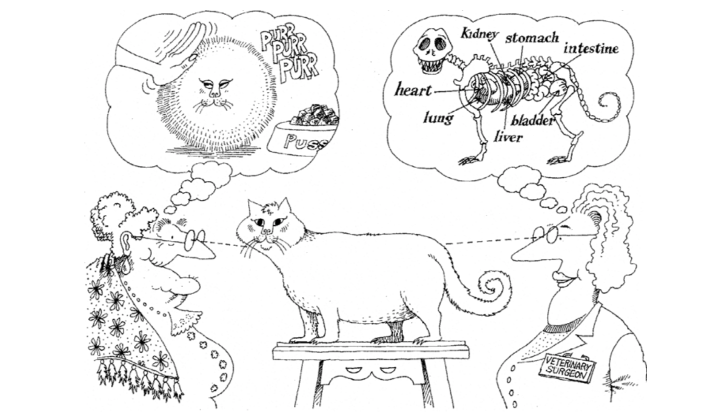

## Введение в объектно-ориентированное программирование

Объектно-ориентированное программирование является очень популярной **парадигмой программирования** (programming paradigm). Парадигма программирования — это **методология проектирования программ**, проще говоря, это способ познания и понимания программ программистом, а также способ написания кода.

В предыдущих уроках мы говорили, что "**программа — это набор инструкций**". При выполнении программы операторы в программе превращаются в одну или несколько инструкций, которые затем выполняются CPU (центральным процессором). Для упрощения проектирования программ мы также говорили о функциях: **помещение относительно независимого и часто повторно используемого кода в функции**, и вызов функций, когда нам нужно использовать этот код. Если функция становится слишком сложной и громоздкой, мы можем дополнительно **разделить функцию на несколько подфункций**, чтобы снизить сложность системы.

Не знаю, заметили ли вы, что программирование на самом деле — это процесс, когда человек, пишущий программу, контролирует машину через код в соответствии с принципами работы компьютера для выполнения задач. Однако принцип работы компьютера отличается от нормального способа мышления человека. Если для программирования необходимо отказаться от нормального человеческого мышления и приспособиться к компьютеру, то удовольствие от программирования значительно уменьшается. Здесь я хочу сказать не то, что мы не можем писать код в соответствии с принципами работы компьютера, но когда нам нужно разработать сложную систему, такой подход делает код слишком сложным, что приводит к тому, что разработка и поддержка становятся чрезвычайно трудными.

С увеличением сложности программного обеспечения написание правильного и надёжного кода становится чрезвычайно сложной задачей. Именно поэтому многие люди твёрдо убеждены, что "разработка программного обеспечения — это самая сложная деятельность среди всех действий человека по преобразованию мира". Как описать сложные системы и решить сложные проблемы с помощью программ становится вопросом, над которым должны задуматься и с которым должны столкнуться все программисты. Язык Smalltalk, появившийся в 70-х годах прошлого века, дал разработчикам программного обеспечения надежду, потому что он ввёл новую парадигму программирования, называемую объектно-ориентированным программированием. В мире объектно-ориентированного программирования **данные программы и функции для работы с данными представляют собой логическое целое**, которое мы называем **объектом**. **Объект может принимать сообщения**, и способ решения проблем заключается в **создании объектов и отправке различных сообщений объектам**. Через передачу сообщений несколько объектов в программе могут совместно работать, что позволяет строить сложные системы и решать реальные проблемы. Конечно, прототип объектно-ориентированного программирования можно проследить до более раннего языка Simula, но это не является темой нашего обсуждения.

> **Примечание:** Многие современные языки программирования высокого уровня поддерживают объектно-ориентированное программирование, но объектно-ориентированное программирование не является "серебряной пулей" для решения всех проблем разработки программного обеспечения, или, другими словами, в индустрии разработки программного обеспечения в настоящее время нет так называемой "серебряной пули". По этому вопросу вы можете обратиться к статье "Нет серебряной пули: сущность и акциденции в разработке программного обеспечения", опубликованной отцом системы IBM360 Фредериком Бруксом, или к классической книге по разработке программного обеспечения "Мифический человеко-месяц".

### Классы и объекты

Если нужно одним предложением обобщить объектно-ориентированное программирование, я считаю, что следующее утверждение довольно точное и меткое.

> **Объектно-ориентированное программирование**: объединение набора данных и методов обработки данных в **объект**, группировка объектов с одинаковым поведением в **класс**, сокрытие внутренних деталей объекта через **инкапсуляцию**, реализация специализации и обобщения класса через **наследование**, реализация динамической диспетчеризации на основе типа объекта через **полиморфизм**.

Это предложение может быть не так просто понять для новичков, но я могу сначала выделить несколько ключевых слов: **объект** (object), **класс** (class), **инкапсуляция** (encapsulation), **наследование** (inheritance), **полиморфизм** (polymorphism).

Давайте сначала поговорим о двух словах: класс и объект. В объектно-ориентированном программировании **класс — это абстрактная концепция, объект — это конкретная концепция**. Извлечение общих характеристик объектов одного типа — это класс. Например, мы часто говорим о человечестве — это абстрактная концепция, а каждый из нас — это реальное существование под абстрактной концепцией человечества, то есть объект. Короче говоря, **класс — это чертёж и шаблон для объекта, объект — это экземпляр класса, сущность, способная принимать сообщения**.

В мире объектно-ориентированного программирования **всё является объектом**, **объекты имеют атрибуты и поведение**, **каждый объект уникален**, и **объект обязательно принадлежит какому-либо классу**. Атрибуты объекта — это статические характеристики объекта, поведение объекта — это динамические характеристики объекта. Согласно вышесказанному, если мы извлечём атрибуты и поведение объектов с общими характеристиками, мы сможем определить класс.


### Определение класса

В языке Python мы можем использовать ключевое слово `class` вместе с именем класса для определения класса. С помощью отступов мы можем определить блок кода класса, так же, как при определении функций. В блоке кода класса нам нужно написать некоторые функции. Мы уже говорили, что класс — это абстрактная концепция, поэтому эти функции представляют собой наше извлечение общих динамических характеристик для класса объектов. Функции, написанные внутри класса, обычно называются **методами**. Методы — это поведение объекта, то есть сообщения, которые может принимать объект. Первый параметр метода обычно `self`, он представляет сам объект, принимающий это сообщение.

```python
class Student:

    def study(self, course_name):
        print(f'Студент изучает {course_name}.')

    def play(self):
        print(f'Студент играет в игры.')
```

### Создание и использование объектов

После определения класса мы можем использовать синтаксис конструктора для создания объектов, как показано в следующем коде.

```python
stu1 = Student()
stu2 = Student()
print(stu1)    # <__main__.Student object at 0x10ad5ac50>
print(stu2)    # <__main__.Student object at 0x10ad5acd0> 
print(hex(id(stu1)), hex(id(stu2)))    # 0x10ad5ac50 0x10ad5acd0
```

Круглые скобки после имени класса — это так называемый синтаксис конструктора. Приведённый выше код создаёт два объекта студента: один присваивается переменной `stu1`, другой — переменной `stu2`. Когда мы печатаем переменные `stu1` и `stu2` с помощью функции `print`, мы видим вывод адреса объекта в памяти (в шестнадцатеричной форме), что совпадает со значением, полученным с помощью функции `id` для проверки идентификатора объекта. Теперь мы можем сказать вам, что переменные, которые мы определяем, на самом деле сохраняют логический адрес (позицию) объекта в памяти. Через этот логический адрес мы можем найти этот объект в памяти. Поэтому оператор присваивания, такой как `stu3 = stu2`, не создаёт новый объект, он только сохраняет адрес существующего объекта в новой переменной.

Далее давайте попробуем отправить сообщения объектам, то есть вызвать методы объектов. В классе `Student`, который мы только что определили, есть два метода: `study` и `play`. Первый параметр `self` обоих методов представляет объект студента, принимающий сообщение. Второй параметр метода `study` — это название изучаемого курса. В Python есть два способа отправки сообщений объектам, посмотрите на код ниже.

```python
# Вызов метода через "Класс.метод"
# Первый параметр — это объект, принимающий сообщение
# Второй параметр — название изучаемого курса
Student.study(stu1, 'программирование на Python')    # Студент изучает программирование на Python.
# Вызов метода через "объект.метод"
# Объект перед точкой — это объект, принимающий сообщение
# Нужно передать только второй параметр — название курса
stu1.study('программирование на Python')             # Студент изучает программирование на Python.

Student.play(stu2)                      # Студент играет в игры.
stu2.play()                             # Студент играет в игры. 
```

### Метод инициализации

Возможно, вы уже заметили, что созданные нами объекты студентов имеют только поведение, но не имеют атрибутов. Если мы хотим определить атрибуты для объектов студентов, мы можем изменить класс `Student`, добавив к нему метод с именем `__init__`. Когда мы вызываем конструктор класса `Student` для создания объекта, сначала в памяти выделяется пространство, необходимое для хранения объекта студента, затем через автоматическое выполнение метода `__init__` завершается операция инициализации памяти, то есть данные помещаются в пространство памяти. Поэтому мы можем, добавив метод `__init__` к классу `Student`, указать атрибуты для объекта студента и одновременно завершить операцию присвоения начальных значений атрибутам. Именно поэтому метод `__init__` обычно также называют методом инициализации.

Давайте немного изменим класс `Student` выше, добавив объектам студентов два атрибута: `name` (имя) и `age` (возраст).

```python
class Student:
    """Студент"""

    def __init__(self, name, age):
        """метод инициализации"""
        self.name = name
        self.age = age

    def study(self, course_name):
        """Изучение"""
        print(f'{self.name} изучает {course_name}.')

    def play(self):
        """Игры"""
        print(f'{self.name} играет в игры.')
```

Изменим код создания объектов и отправки сообщений объектам, выполним его снова и посмотрим, как изменится результат выполнения программы.

```python
# Вызов конструктора класса Student для создания объекта и передачи параметров инициализации
stu1 = Student('Ло Хао', 44)
stu2 = Student('Ван Дачуй', 25)
stu1.study('Python程序设计')    # Ло Хао изучает программирование на Python.
stu2.play()                    # Ван Дачуй играет в игры.
```


### Столпы объектно-ориентированного программирования

У объектно-ориентированного программирования есть три столпа — это три слова, которые мы выделили ранее: **инкапсуляция**, **наследование** и **полиморфизм**. Последние два понятия будут подробно объяснены на следующем уроке, здесь мы сначала поговорим о том, что такое инкапсуляция. Моё собственное понимание инкапсуляции следующее: **скрытие всех деталей реализации, которые можно скрыть, предоставление внешнему миру только простого интерфейса вызова**. Методы объектов, которые мы определяем в классе, на самом деле являются своего рода инкапсуляцией. Такая инкапсуляция позволяет нам после создания объекта просто отправить сообщение объекту для выполнения кода в методе. То есть мы можем использовать метод, зная только имя метода и параметры (внешнее представление метода), не зная внутренних деталей реализации метода (внутреннее представление метода).

Приведу пример: предположим, нужно управлять роботом, чтобы он налил мне стакан воды. Если не использовать объектно-ориентированное программирование и не делать никакой инкапсуляции, то нужно отправить роботу серию инструкций, таких как: встать, повернуться налево, пройти 5 шагов вперёд, взять стакан перед собой, повернуться назад, пройти 10 шагов вперёд, наклониться, поставить стакан, нажать кнопку подачи воды, подождать 10 секунд, отпустить кнопку подачи воды, взять стакан, повернуться направо, пройти 5 шагов вперёд, поставить стакан и так далее, чтобы выполнить эту простую операцию. Даже думать об этом утомительно. Согласно идеям объектно-ориентированного программирования, мы можем инкапсулировать операцию наливания воды в метод робота. Когда нам нужно, чтобы робот налил нам воды, достаточно просто отправить роботу-объекту сообщение о наливании воды. Разве это не лучше?

Во многих случаях объектно-ориентированное программирование — это процесс из трёх шагов. Первый шаг — определить класс, второй шаг — создать объект, третий шаг — отправить сообщение объекту. Конечно, иногда первый шаг нам не нужен, потому что класс, который мы хотим использовать, возможно, уже существует. Как мы говорили ранее, встроенные в Python `list`, `set`, `dict` на самом деле являются классами. Если нам нужно создать объекты списка, множества или словаря, нам не нужно определять класс самостоятельно. Конечно, некоторые классы не предоставляются напрямую в стандартной библиотеке Python, они могут быть из стороннего кода. Как установить и использовать сторонний код, будет обсуждаться в последующих уроках. В некоторых особых случаях мы будем использовать объекты, называемые "встроенными объектами". Так называемые "встроенные объекты" означают, что первый и второй шаги из трёх шагов выше не нужны, потому что класс уже существует и объект уже был создан. Достаточно просто отправить сообщение объекту. Это то, что мы обычно называем "готово к использованию".

### Примеры объектно-ориентированного программирования

#### Пример 1: Часы

> **Задание**: Определить класс для описания цифровых часов, предоставить функционал хода времени и отображения времени.

```python
import time


# Определение класса часов
class Clock:
    """Цифровые часы"""

    def __init__(self, hour=0, minute=0, second=0):
        """метод инициализации
        :param hour: час
        :param minute: минута
        :param second: секунда
        """
        self.hour = hour
        self.min = minute
        self.sec = second

    def run(self):
        """Ход времени"""
        self.sec += 1
        if self.sec == 60:
            self.sec = 0
            self.min += 1
            if self.min == 60:
                self.min = 0
                self.hour += 1
                if self.hour == 24:
                    self.hour = 0

    def show(self):
        """Показать время"""
        return f'{self.hour:0>2d}:{self.min:0>2d}:{self.sec:0>2d}'


# Создание объекта часов
clock = Clock(23, 59, 58)
while True:
    # Отправка сообщения объекту часов для чтения времени
    print(clock.show())
    # Приостановка на 1 секунду
    time.sleep(1)
    # Отправка сообщения объекту часов для хода времени
    clock.run()
```

#### Пример 2: Точка на плоскости

>  **Задание**: Определить класс для описания точки на плоскости, предоставить метод вычисления расстояния до другой точки.

```python
class Point:
    """Точка на плоскости"""

    def __init__(self, x=0, y=0):
        """метод инициализации
        :param x: абсцисса
        :param y: ордината
        """
        self.x, self.y = x, y

    def distance_to(self, other):
        """вычислить расстояние до другой точки
        :param other: другая точка
        """
        dx = self.x - other.x
        dy = self.y - other.y
        return (dx * dx + dy * dy) ** 0.5

    def __str__(self):
        return f'({self.x}, {self.y})'


p1 = Point(3, 5)
p2 = Point(6, 9)
print(p1)  # вызов магического метода объекта str
print(p2)
print(p1.distance_to(p2))
```

### Резюме

Объектно-ориентированное программирование — это очень популярная парадигма программирования. Помимо неё существуют также **императивное программирование**, **функциональное программирование** и другие парадигмы программирования. Поскольку реальный мир состоит из объектов, а объекты являются сущностями, способными принимать сообщения, **объектно-ориентированное программирование больше соответствует нормальным привычкам человеческого мышления**. Класс абстрактен, объект конкретен. Имея класс, можно создавать объекты, имея объекты, можно принимать сообщения — это основа объектно-ориентированного программирования. Процесс определения класса — это процесс абстракции: нахождение общих атрибутов объектов относится к абстракции данных, нахождение общих методов объектов относится к абстракции поведения. Процесс абстракции — это процесс, в котором каждый видит по-своему. Абстрагирование объектов одного класса может привести к разным результатам, как показано на рисунке ниже.



> **Примечание:** Иллюстрации в этом уроке взяты из книги "Объектно-ориентированный анализ и проектирование", написанной Грэди Бучем и другими авторами. Эта книга является классическим трудом по объектно-ориентированному программированию. Заинтересованные читатели могут приобрести и прочитать эту книгу, чтобы узнать больше об объектно-ориентированном программировании.

