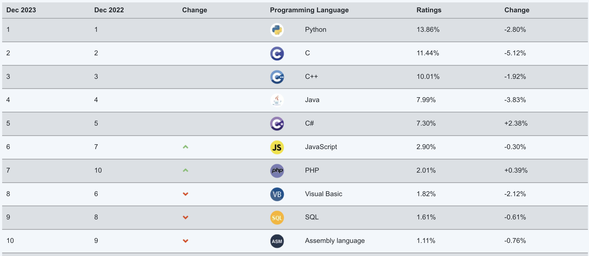
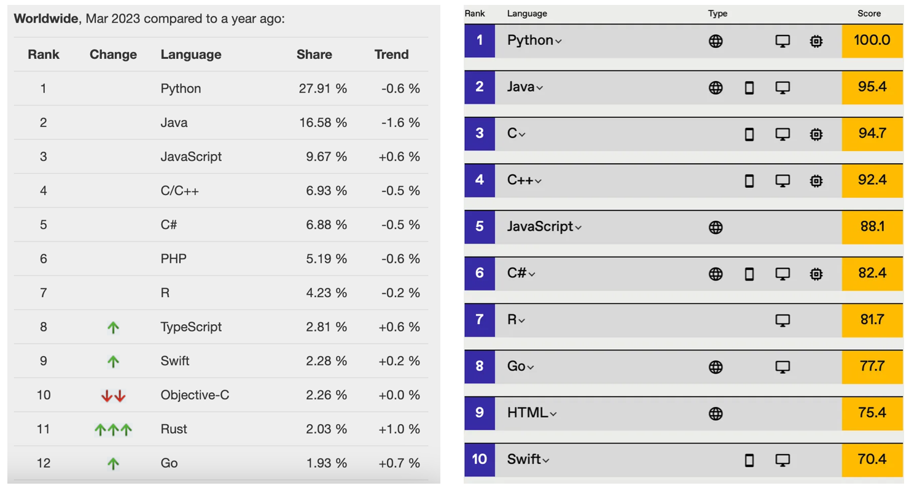
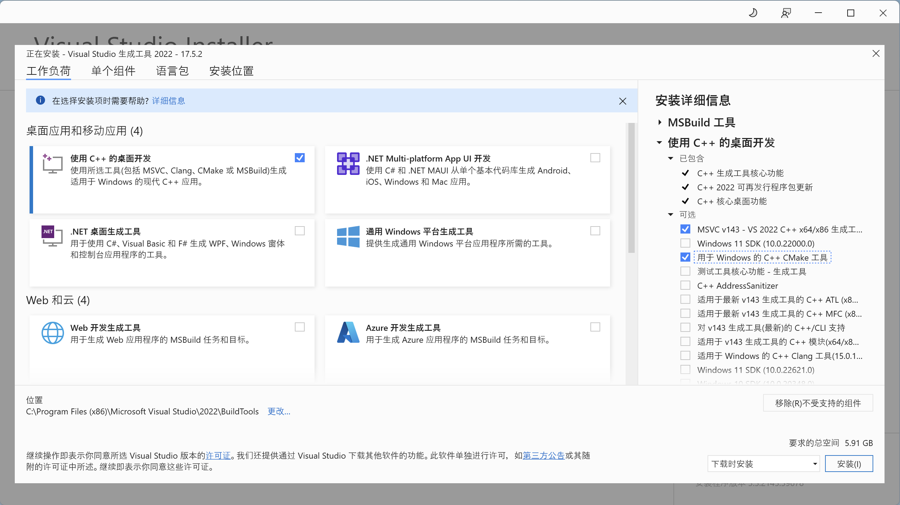
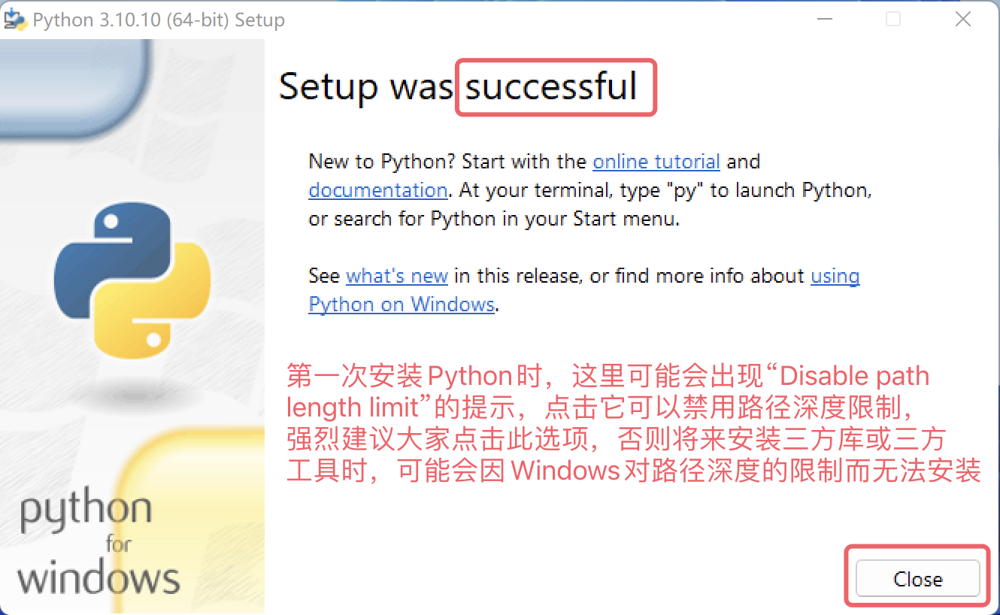
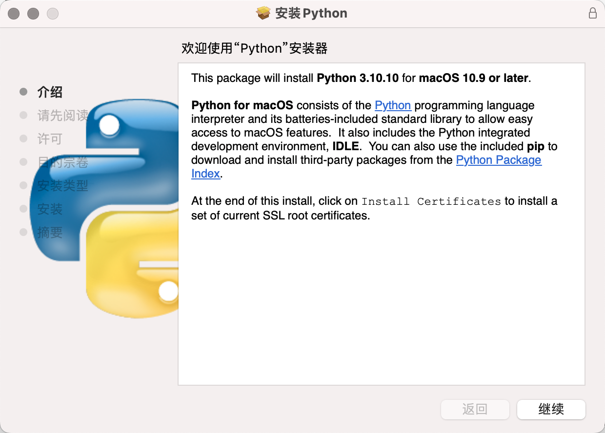

# День 1 — Первое знакомство с Python
## Введение в Python
Python (британское произношение: /ˈpaɪθən/; американское произношение: /ˈpaɪθɑːn/) — это язык программирования, изобретенный голландцем Гвидо ван Россумом (Guido van Rossum). На сегодняшний день это самый популярный язык программирования в мире с наибольшим количеством пользователей. Python делает акцент на читаемости кода и простоте синтаксиса. По сравнению с такими влиятельными языками программирования, как C, C++ и Java, Python позволяет пользователям выразить свои намерения с меньшим количеством кода. Ниже представлены рейтинги языка Python от нескольких авторитетных источников. Первое изображение предоставлено TIOBE Index, третье — IEEE Spectrum. Второе изображение заслуживает особого внимания, оно показывает популярность языков программирования на крупнейшей в мире платформе для хостинга кода GitHub, где последние четыре года Python занимает первое место.


### История Python
#### Происхождение Python
1989 год: Рождественские каникулы, Амстердам. Гвидо ван Россум, чтобы скоротать время, решил разработать новый скриптовый язык — интерпретатор для языка ABC. Причины следующие:
- Увлечение языком ABC, но неудовлетворенность его недостатками
- Личный интерес к программированию и желание создать собственный язык

Название «Python» происходит не от змеи, а от британского комедийного сериала «Летающий цирк Монти Пайтона» (Monty Python's Flying Circus), который Гвидо любил смотреть.
#### Важные вехи
- 1991: Первый интерпретатор Python родился, написан на языке C (до сих пор называется CPython), способен вызывать библиотеки языка C
- 1994: Python 1.0 официально выпущен
- 2000: Python 2.0 с важными функциями (сборщик мусора, поддержка Unicode)
- 2008: Python 3.0, несовместимая с версией 2.x
- 2010: Python 2.7 — последняя версия 2.x
- 2020: Официальный конец поддержки Python 2
- 2024: Текущая стабильная версия — Python 3.13

### Философия Python
Python следует философии «Дзен Python» (PEP 20), где подчеркиваются принципы простоты и читаемости. Введите в интерпретаторе Python:
```python
import this
```

Вы увидите 19 афоризмов:
```
The Zen of Python, by Tim Peters

Beautiful is better than ugly.
Explicit is better than implicit.
Simple is better than complex.
Complex is better than complicated.
Flat is better than nested.
Sparse is better than dense.
Readability counts.
Special cases aren't special enough to break the rules.
Although practicality beats purity.
Errors should never pass silently.
Unless explicitly silenced.
In the face of ambiguity, refuse the temptation to guess.
There should be one-- and preferably only one --obvious way to do it.
Although that way may not be obvious at first unless you're Dutch.
Now is better than never.
Although never is often better than *right* now.
If the implementation is hard to explain, it's a bad idea.
If the implementation is easy to explain, it may be a good idea.
Namespaces are one honking great idea -- let's do more of those!
```

### Преимущества Python
1. **Простой синтаксис** — читается почти как английский текст
2. **Богатая экосистема** — сотни тысяч библиотек на PyPI
3. **Кроссплатформенность** — работает на Windows, macOS, Linux
4. **Широкое применение** — веб, анализ данных, AI, автоматизация
5. **Отличное сообщество** — множество ресурсов для обучения

### Недостатки Python
1. **Медленнее компилируемых языков** — Python — интерпретируемый язык
2. **Ограничения в мобильной разработке** — не идеален для Android/iOS
3. **Проблемы многопоточности** — из-за GIL (Global Interpreter Lock)
4. **Версионные проблемы** — миграция 2.x → 3.x заняла годы

## Установка Python
### Windows
1. Перейдите на официальный сайт: [python.org](https://www.python.org/)
2. Нажмите «Downloads» → выберите последнюю стабильную версию


3. Запустите установщик:
   - ✅ **Обязательно** отметьте «Add Python to PATH»
   - Нажмите «Install Now»


4. Дождитесь завершения установки

5. Проверьте установку:
   - Откройте командную строку (Win + R → `cmd`)
   - Введите: `python --version`

#### Важно для Windows!
Если у вас возникают проблемы с установкой пакетов (особенно с C-расширениями), может потребоваться установить **Microsoft C++ Build Tools**:
1. Скачайте [Build Tools](https://visualstudio.microsoft.com/downloads/)

2. Установите «Desktop development with C++»


### macOS
#### Через Homebrew (рекомендуется):
```bash
# Установка Homebrew (если еще не установлен)
/bin/bash -c "$(curl -fsSL https://raw.githubusercontent.com/Homebrew/install/HEAD/install.sh)"

# Установка Python
brew install python
```

#### Через официальный установщик:
1. Скачайте .pkg с [python.org](https://www.python.org/)
2. Запустите установщик
3. Следуйте инструкциям

### Linux
#### Ubuntu/Debian:
```bash
sudo apt update
sudo apt install python3 python3-pip python3-venv
```

#### Fedora:
```bash
sudo dnf install python3 python3-pip
```

#### Arch Linux:
```bash
sudo pacman -S python python-pip
```

### Проверка установки
После установки проверьте версию Python:
```bash
python --version
# или
python3 --version
```

Проверьте pip (менеджер пакетов):
```bash
pip --version
# или
pip3 --version
```

## Настройка среды разработки
### Рекомендуемые редакторы и IDE
#### 1. Visual Studio Code (VS Code)
**Лучший выбор для начинающих!**
- Бесплатный, легковесный
- Отличная поддержка Python
- Установка:
  1. Скачайте с [code.visualstudio.com](https://code.visualstudio.com/)
  2. Установите расширение «Python» (от Microsoft)

#### 2. PyCharm
- Профессиональная IDE для Python
- Community Edition — бесплатная
- Скачать: [jetbrains.com/pycharm](https://www.jetbrains.com/pycharm/)

#### 3. Jupyter Notebook/JupyterLab
- Идеально для анализа данных и обучения
- Установка:
```bash
pip install jupyter
jupyter notebook
```

#### 4. Другие опции
- **Sublime Text** с плагином Anaconda
- **Vim/Neovim** с плагинами для Python
- **Thonny** — простая IDE для обучения

### Виртуальные окружения
Важно использовать виртуальные окружения для изоляции зависимостей проектов.

#### venv (встроенный модуль):
```bash
# Создание виртуального окружения
python -m venv myenv

# Активация (Windows)
myenv\Scripts\activate

# Активация (macOS/Linux)
source myenv/bin/activate

# Деактивация
deactivate
```

#### Poetry (современный инструмент):
```bash
# Установка Poetry
curl -sSL https://install.python-poetry.org | python3 -

# Создание проекта
poetry new myproject
cd myproject
poetry install

# Активация окружения
poetry shell
```

#### conda (для научных вычислений):
```bash
# Установите Miniconda или Anaconda
# https://docs.conda.io/en/latest/miniconda.html

# Создание окружения
conda create -n myenv python=3.11

# Активация/деактивация — аналогично venv
```

## Первая программа на Python
### Интерактивный режим (REPL)
REPL (Read-Eval-Print Loop) — интерактивный интерпретатор Python. Запустите его, набрав `python` или `python3` в терминале:
```bash
python
```

Вы увидите приглашение `>>>`. Попробуйте:
```python
>>> print("Hello, World!")
Hello, World!
>>> 2 + 2
4
>>> exit()
```


### Запуск Python-скриптов
Создайте файл `hello.py`:
```python
print("Hello, World!")
print("Привет, Python!")
```

Запустите его:
```bash
python hello.py
```

Вывод:
```
Hello, World!
Привет, Python!
```


### Комментарии
```python
# Это однострочный комментарий

"""
Это многострочный
комментарий (docstring)
"""

'''
Тоже многострочный
комментарий
'''
```

## Резюме
В первый день мы:
1. Познакомились с историей и философией Python
2. Узнали о преимуществах и недостатках языка
3. Установили Python на различных платформах
4. Настроили среду разработки
5. Написали первую программу

Продолжайте изучение! В следующем уроке мы погрузимся в синтаксис и типы данных Python.
